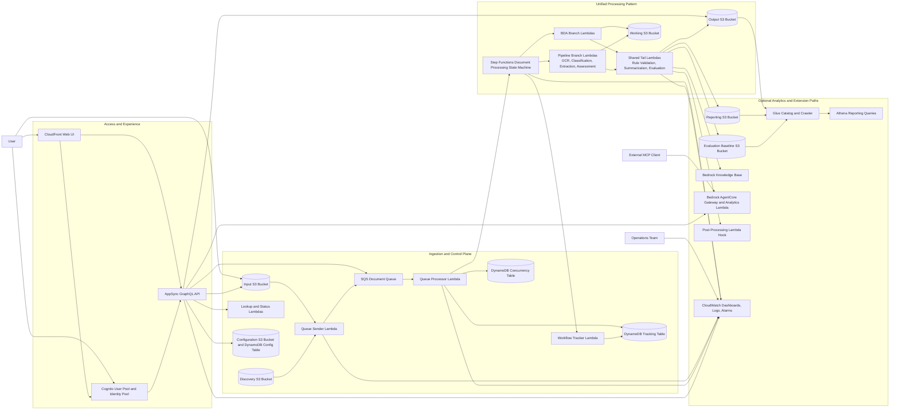

# Repository Architecture

This diagram is a C4-style container view of the system deployed by this repository. It is based on the main SAM stack in `template.yaml`, the unified processing pattern in `patterns/unified/template.yaml`, and the AppSync nested stack in `nested/appsync/template.yaml`.

## Component Notes

- Web access is provided through CloudFront, with Cognito handling authentication and AppSync acting as the main application API.
- Documents typically enter through the Input S3 bucket, then move through `QueueSender`, `DocumentQueue`, and `QueueProcessor` before a Step Functions execution is started.
- The unified pattern stack supports two runtime paths: a BDA branch and a pipeline branch. Both converge on shared downstream steps such as rule validation, summarization, and evaluation.
- Output artifacts are stored in S3 and can feed optional evaluation reporting, Athena or Glue analytics, Bedrock Knowledge Base indexing, and external MCP access through AgentCore.
- DynamoDB tables back execution tracking, workflow concurrency control, agent data, and configuration state.
