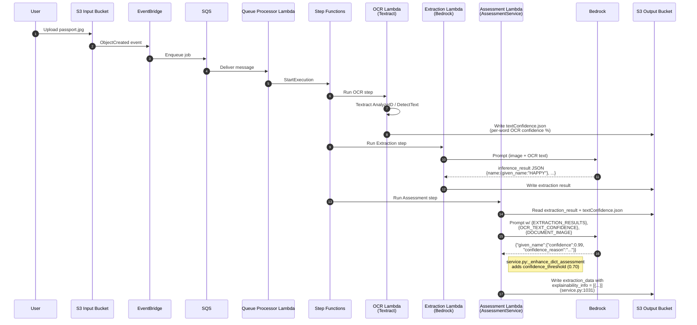
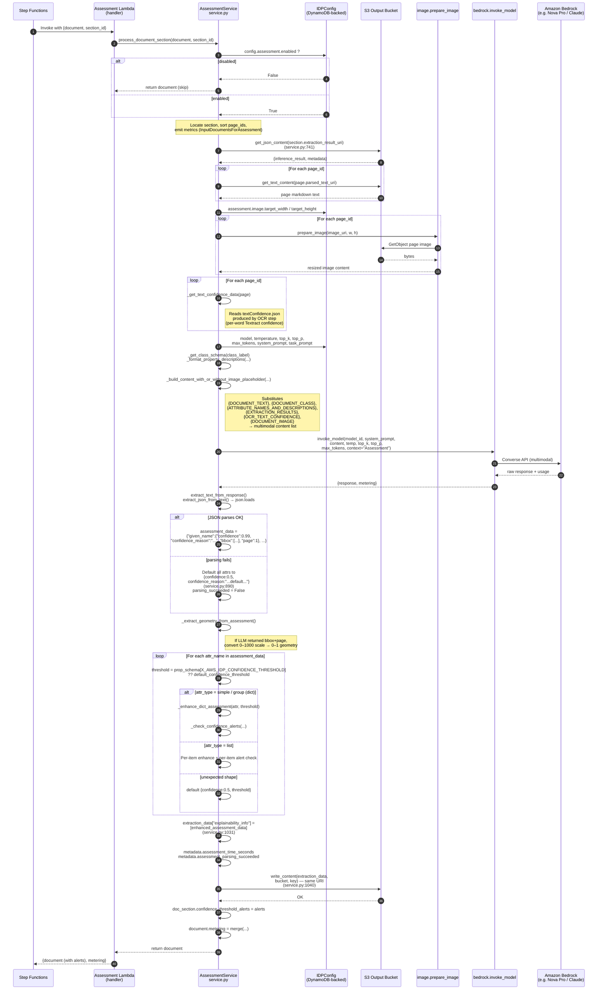
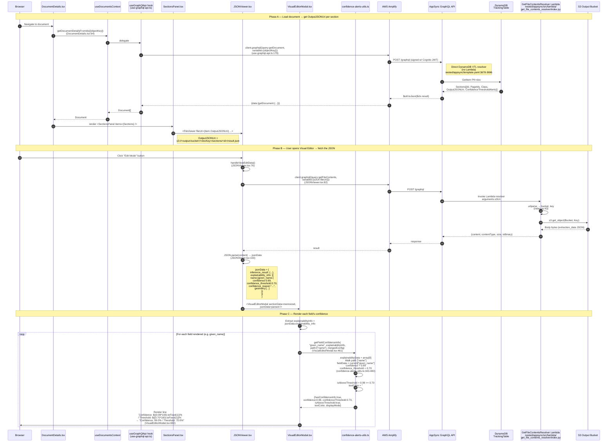

# Confidence Data Flow — End-to-End Sequence

This document traces how a per-field confidence score (e.g. `Confidence: 99.0% / Threshold: 70.0%` shown next to an extracted value in the Visual Editor) is produced by the backend pipeline and rendered in the UI.

The confidence number is **not** a formula. It is an LLM self-assessment produced by the Assessment step of the Step Functions workflow. The UI reads the stored value and multiplies by 100 for display.

---

## 1. Write path — backend produces `explainability_info.confidence`



---

## 2. Assessment step — internal detail

Shows prompt construction, Bedrock invocation, parsing, threshold enhancement, and the write back to S3.



### What each attribute looks like at the end

After the loop at [lib/idp_common_pkg/idp_common/assessment/service.py:919-1028](../lib/idp_common_pkg/idp_common/assessment/service.py#L919-L1028), the object written to `explainability_info[0]` has the shape the UI consumes:

```json
{
  "name": {
    "given_name": {
      "confidence": 0.99,
      "confidence_reason": "Clearly visible in MRZ and visual zone",
      "confidence_threshold": 0.70,
      "geometry": [{ "boundingBox": { "top": 0.2, "left": 0.1, "width": 0.2, "height": 0.05 }, "page": 1 }]
    }
  }
}
```

---

## 3. Read path — UI fetches and renders the confidence



---

## 4. `DocumentDetails.tsx` does not import `GetDocument` directly

`DocumentDetails.tsx` calls a context method; the actual GraphQL call lives in a hook.

### Call chain

```
DocumentDetails.tsx:64   sendInitDocumentRequests()
  └─ getDocumentDetailsFromIds([objectKey])      ← destructured from useDocumentsContext() at line 51
        │
        │  useDocumentsContext → src/ui/src/contexts/documents.ts (context type only)
        │  Provider implementation is in the custom hook:
        │
        └─ src/ui/src/hooks/use-graphql-api.ts:176-192
              const getDocumentPromises = objectKeys.map((objectKey) =>
                client.graphql({ query: getDocument, variables: { objectKey } })
              );
              ▲ This is the actual AppSync call (line 179).
              `getDocument` imported at use-graphql-api.ts:12 from '../graphql/generated',
               which re-exports the compiled query from
               src/ui/src/graphql/operations/queries/GetDocument.graphql
```

### Exact call sites

| File | Line | Role |
|---|---|---|
| [DocumentDetails.tsx:51](../src/ui/src/components/document-details/DocumentDetails.tsx#L51) | Destructure `getDocumentDetailsFromIds` from `useDocumentsContext()` |
| [DocumentDetails.tsx:64](../src/ui/src/components/document-details/DocumentDetails.tsx#L64) | `await getDocumentDetailsFromIds([objectKey])` in `sendInitDocumentRequests`, called from `useEffect` at [:74-80](../src/ui/src/components/document-details/DocumentDetails.tsx#L74-L80) |
| [use-graphql-api.ts:12](../src/ui/src/hooks/use-graphql-api.ts#L12) | `import { getDocument } from '../graphql/generated'` |
| [use-graphql-api.ts:176-192](../src/ui/src/hooks/use-graphql-api.ts#L176-L192) | Defines `getDocumentDetailsFromIds`; line 179 issues `client.graphql({ query: getDocument, ... })` |
| [contexts/documents.ts:13](../src/ui/src/contexts/documents.ts#L13) | Context type: `getDocumentDetailsFromIds: (objectKeys: string[]) => Promise<Document[]>` |

### Why it's wrapped in a context

- List views receive lightweight data via `listDocuments` / subscriptions (no `Sections` field).
- Detail views need the heavier payload including `Sections[].OutputJSONUri`.
- `getDocumentDetailsFromIds` is the only path that issues `GetDocument`, and it is **not** called by subscription handlers ([use-graphql-api.ts:195](../src/ui/src/hooks/use-graphql-api.ts#L195)) — subscriptions already carry rich payloads.
- `DocumentDetails.tsx` triggers it exactly once per `objectKey` mount, then relies on `onUpdateDocument` subscription events handled in the same context to keep state fresh.

---

## 5. Summary of backend calls on the read path

| # | UI call | GraphQL op | Lambda / data source (file path) | Purpose |
|---|---|---|---|---|
| 1 | [DocumentDetails.tsx:64](../src/ui/src/components/document-details/DocumentDetails.tsx#L64) → [use-graphql-api.ts:179](../src/ui/src/hooks/use-graphql-api.ts#L179) | [GetDocument](../src/ui/src/graphql/operations/queries/GetDocument.graphql) | **Direct DynamoDB VTL resolver** — no Lambda. VTL templates inline in [nested/appsync/template.yaml:3678-3696](../nested/appsync/template.yaml#L3678-L3696). Data source: `TrackingTableDataSource` (DynamoDB, `GetItem` on `PK=doc#<ObjectKey>, SK=none`) | Returns `Sections[].OutputJSONUri` |
| 2 | [JSONViewer.tsx:82](../src/ui/src/components/document-viewer/JSONViewer.tsx#L82) | [GetFileContents](../src/ui/src/graphql/operations/queries/GetFileContents.graphql) | Lambda: [nested/appsync/src/lambda/get_file_contents_resolver/index.py](../nested/appsync/src/lambda/get_file_contents_resolver/index.py) — calls `s3.get_object` on the Output bucket. CFN resource at [nested/appsync/extracted_resources.yaml:881-930](../nested/appsync/extracted_resources.yaml#L881-L930) | Reads the extraction JSON (with `explainability_info`) from S3 |
| 3 | [JSONViewer.tsx:103](../src/ui/src/components/document-viewer/JSONViewer.tsx#L103) | — (client) | `JSON.parse` | Parses the JSON string |
| 4 | [VisualEditorModal.tsx:461](../src/ui/src/components/document-viewer/VisualEditorModal.tsx#L461) | — (client) | [confidence-alerts-utils.ts:332-431](../src/ui/src/components/common/confidence-alerts-utils.ts#L332-L431) `getFieldConfidenceInfo` | Walks `explainability_info[0]` along field path, reads `confidence` + `confidence_threshold` |
| 5 | [VisualEditorModal.tsx:650](../src/ui/src/components/document-viewer/VisualEditorModal.tsx#L650) | — (client) | React render | Displays `Confidence: 99.0% / Threshold: 70.0%` |

### Why two AppSync calls (not one)

The `OutputJSONUri` is kept as a pointer in DynamoDB; the actual extraction JSON (potentially large, with per-field reasons and geometries) lives in S3. This separation keeps `GetDocument` fast for the list/detail view and defers the heavier S3 read until the user opens the Visual Editor. The `ConfidenceThresholdAlerts` summary *is* returned directly on `GetDocument` — that is how the Document Details header can show the "Confidence Alerts: 0" badge without opening the JSON.

---

## 6. Key source references

### Backend — assessment (write path)
- Entry: [process_document_section](../lib/idp_common_pkg/idp_common/assessment/service.py#L669)
- Prompt build (with image placeholder): [_build_content_with_or_without_image_placeholder](../lib/idp_common_pkg/idp_common/assessment/service.py#L473)
- Template substitution: [_prepare_prompt_from_template](../lib/idp_common_pkg/idp_common/assessment/service.py#L292)
- Bedrock call: [service.py:856](../lib/idp_common_pkg/idp_common/assessment/service.py#L856)
- Parse failure fallback → `0.5`: [service.py:890-895](../lib/idp_common_pkg/idp_common/assessment/service.py#L890-L895)
- bbox → geometry conversion: [_extract_geometry_from_assessment at :900](../lib/idp_common_pkg/idp_common/assessment/service.py#L900)
- Threshold attach: [_enhance_dict_assessment at :945](../lib/idp_common_pkg/idp_common/assessment/service.py#L945)
- Alert emission: [_check_confidence_alerts at :950](../lib/idp_common_pkg/idp_common/assessment/service.py#L950)
- Persist: [service.py:1031](../lib/idp_common_pkg/idp_common/assessment/service.py#L1031), [:1040](../lib/idp_common_pkg/idp_common/assessment/service.py#L1040)

### Frontend — read path
- [confidence-alerts-utils.ts:332-431](../src/ui/src/components/common/confidence-alerts-utils.ts#L332-L431) — `getFieldConfidenceInfo`
- [VisualEditorModal.tsx:461](../src/ui/src/components/document-viewer/VisualEditorModal.tsx#L461) — call site
- [VisualEditorModal.tsx:650](../src/ui/src/components/document-viewer/VisualEditorModal.tsx#L650) — render formula `(confidence * 100).toFixed(1)%`
- [JSONViewer.tsx:76-120](../src/ui/src/components/document-viewer/JSONViewer.tsx#L76-L120) — `handleViewEditData` flow

### AppSync
- [GetDocument.graphql](../src/ui/src/graphql/operations/queries/GetDocument.graphql)
- [GetFileContents.graphql](../src/ui/src/graphql/operations/queries/GetFileContents.graphql)
- [template.yaml:3678-3696](../nested/appsync/template.yaml#L3678-L3696) — direct DDB resolver for `getDocument`
- [get_file_contents_resolver/index.py](../nested/appsync/src/lambda/get_file_contents_resolver/index.py) — Lambda resolver for `getFileContents`
