# File Upload Sequence

This diagram shows the end-to-end upload flow implemented by the AppSync upload resolver in `nested/appsync/src/lambda/upload_resolver/index.py`, the input bucket eventing in `template.yaml`, and the ingestion Lambdas in `src/lambda/queue_sender` and `src/lambda/queue_processor`.

```mermaid
sequenceDiagram
    actor User as User
    participant UI as UploadDocumentPanel\nsrc/ui/src/components/upload-document/UploadDocumentPanel.tsx
    participant AppSync as AppSync GraphQL API\ntemplate.yaml + nested/appsync/template.yaml
    participant Upload as UploadResolver Lambda\nnested/appsync/src/lambda/upload_resolver/index.py
    participant S3 as Input S3 Bucket\ntemplate.yaml
    participant EB as EventBridge\ntemplate.yaml
    participant Sender as QueueSender Lambda\nsrc/lambda/queue_sender/index.py
    participant DDB as Tracking and Config DynamoDB\ntemplate.yaml + src/lambda/queue_sender/index.py + src/lambda/queue_processor/index.py
    participant SQS as DocumentQueue\ntemplate.yaml
    participant Processor as QueueProcessor Lambda\nsrc/lambda/queue_processor/index.py
    participant Work as Working S3 Bucket\ntemplate.yaml + src/lambda/queue_processor/index.py
    participant SFN as Step Functions State Machine\ntemplate.yaml + patterns/unified/template.yaml + src/lambda/queue_processor/index.py

    User->>UI: Choose file to upload
    UI->>AppSync: Mutation uploadDocument(fileName, contentType, prefix, version)
    AppSync->>Upload: Invoke Lambda data source
    Upload->>S3: generate_presigned_post(bucket, key, metadata)
    S3-->>Upload: Presigned POST form fields and URL
    Upload-->>AppSync: presignedUrl, objectKey, usePostMethod
    AppSync-->>UI: Upload instructions

    UI->>S3: HTTP POST file to InputBucket using presigned form
    S3-->>UI: Upload success

    S3->>EB: Object-created event
    EB->>Sender: Invoke QueueSender
    Sender->>S3: Read object metadata
    Sender->>DDB: Resolve active config version if needed
    Sender->>DDB: Create queued document record
    Sender->>SQS: Send serialized document message

    SQS->>Processor: Deliver queued document
    Processor->>DDB: Check and increment concurrency
    Processor->>Work: Serialize compressed document payload
    Processor->>DDB: Read merged configuration
    Processor->>SFN: Start document-processing execution
    Processor->>DDB: Update document status to RUNNING
    SFN-->>Processor: Execution ARN recorded
```

## Notes

- The first phase is synchronous: the UI asks AppSync for a presigned upload target.
- The second phase starts only after the browser uploads the file into the input bucket.
- `UploadResolver` does not process the document contents. It only returns a signed upload target.
- Actual ingestion starts from the S3 object-created event, then moves through `QueueSender`, `DocumentQueue`, and `QueueProcessor`.
- `QueueProcessor` compresses the document payload into the working bucket before starting the Step Functions workflow.
- Source files shown in the diagram:
  `src/ui/src/components/upload-document/UploadDocumentPanel.tsx`,
  `template.yaml`,
  `nested/appsync/template.yaml`,
  `nested/appsync/src/lambda/upload_resolver/index.py`,
  `patterns/unified/template.yaml`,
  `src/lambda/queue_sender/index.py`, and
  `src/lambda/queue_processor/index.py`.
