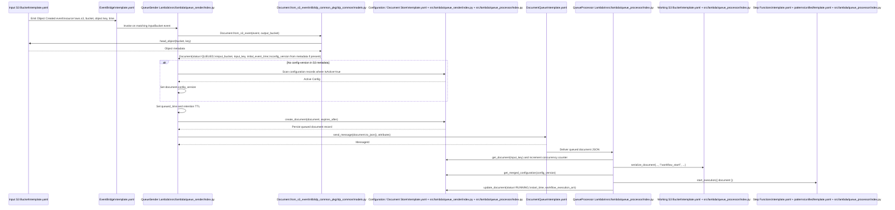

# File Upload Sequence

This diagram shows the end-to-end upload flow implemented by the AppSync upload resolver in `nested/appsync/src/lambda/upload_resolver/index.py`, the input bucket eventing in `template.yaml`, and the ingestion Lambdas in `src/lambda/queue_sender` and `src/lambda/queue_processor`.

```mermaid
sequenceDiagram
    actor User as User
    participant UI as UploadDocumentPanel\nsrc/ui/src/components/upload-document/UploadDocumentPanel.tsx
    participant AppSync as AppSync GraphQL API\ntemplate.yaml + nested/appsync/template.yaml
    participant Upload as UploadResolver Lambda\nnested/appsync/src/lambda/upload_resolver/index.py
    participant S3 as Input S3 Bucket\ntemplate.yaml
    participant EB as EventBridge\ntemplate.yaml
    participant Sender as QueueSender Lambda\nsrc/lambda/queue_sender/index.py
    participant DDB as Tracking and Config DynamoDB\ntemplate.yaml + src/lambda/queue_sender/index.py + src/lambda/queue_processor/index.py
    participant SQS as DocumentQueue\ntemplate.yaml
    participant Processor as QueueProcessor Lambda\nsrc/lambda/queue_processor/index.py
    participant Work as Working S3 Bucket\ntemplate.yaml + src/lambda/queue_processor/index.py
    participant SFN as Step Functions State Machine\ntemplate.yaml + patterns/unified/template.yaml + src/lambda/queue_processor/index.py

    User->>UI: Choose file to upload
    UI->>AppSync: Mutation uploadDocument(fileName, contentType, prefix, version)
    AppSync->>Upload: Invoke Lambda data source
    Upload->>S3: generate_presigned_post(bucket, key, metadata)
    S3-->>Upload: Presigned POST form fields and URL
    Upload-->>AppSync: presignedUrl, objectKey, usePostMethod
    AppSync-->>UI: Upload instructions

    UI->>S3: HTTP POST file to InputBucket using presigned form
    S3-->>UI: Upload success

    S3->>EB: Object-created event
    EB->>Sender: Invoke QueueSender
    Sender->>S3: Read object metadata
    Sender->>DDB: Resolve active config version if needed
    Sender->>DDB: Create queued document record
    Sender->>SQS: Send serialized document message

    SQS->>Processor: Deliver queued document
    Processor->>DDB: Check and increment concurrency
    Processor->>Work: Serialize compressed document payload
    Processor->>DDB: Read merged configuration
    Processor->>SFN: Start document-processing execution
    Processor->>DDB: Update document status to RUNNING
    SFN-->>Processor: Execution ARN recorded
```

## Notes

- The first phase is synchronous: the UI asks AppSync for a presigned upload target.
- The second phase starts only after the browser uploads the file into the input bucket.
- `UploadResolver` does not process the document contents. It only returns a signed upload target.
- Actual ingestion starts from the S3 object-created event, then moves through `QueueSender`, `DocumentQueue`, and `QueueProcessor`.
- `QueueProcessor` compresses the document payload into the working bucket before starting the Step Functions workflow.
- S3 -> EventBridge rule (declared as CloudWatchEvent in SAM) -> QueueSender Lambda
- Source files shown in the diagram:
  `src/ui/src/components/upload-document/UploadDocumentPanel.tsx`,
  `template.yaml`,
  `nested/appsync/template.yaml`,
  `nested/appsync/src/lambda/upload_resolver/index.py`,
  `patterns/unified/template.yaml`,
  `src/lambda/queue_sender/index.py`, and
  `src/lambda/queue_processor/index.py`.

### Detail for "S3->>EB: Object-created event"
- The input bucket has `EventBridgeEnabled: true`, so every successful object write emits an EventBridge event from source `aws.s3` with detail type `Object Created`.
- The `QueueSender` Lambda is subscribed through a SAM `CloudWatchEvent` rule filtered to the configured `InputBucket`.
- `QueueSender` does not receive the file bytes. It receives the EventBridge envelope, extracts `detail.bucket.name`, `detail.object.key`, and `time`, then reconstructs document state from AWS APIs.

```mermaid
sequenceDiagram
    participant S3 as Input S3 Bucket\ntemplate.yaml
    participant EB as EventBridge\ntemplate.yaml
    participant Sender as QueueSender Lambda\nsrc/lambda/queue_sender/index.py
    participant Meta as Document.from_s3_event\nlib/idp_common_pkg/idp_common/models.py
    participant DDB as Configuration / Document Store\ntemplate.yaml + src/lambda/queue_sender/index.py + src/lambda/queue_processor/index.py
    participant SQS as DocumentQueue\ntemplate.yaml
    participant Processor as QueueProcessor Lambda\nsrc/lambda/queue_processor/index.py
    participant Work as Working S3 Bucket\ntemplate.yaml + src/lambda/queue_processor/index.py
    participant SFN as Step Functions\ntemplate.yaml + patterns/unified/template.yaml + src/lambda/queue_processor/index.py

    S3->>EB: Emit Object Created event\nsource=aws.s3, bucket, object key, time
    EB->>Sender: Invoke on matching InputBucket event

    Sender->>Meta: Document.from_s3_event(event, output_bucket)
    Meta->>S3: head_object(bucket, key)
    S3-->>Meta: Object metadata
    Meta-->>Sender: Document(status=QUEUED,\ninput_bucket, input_key, initial_event_time,\nconfig_version from metadata if present)

    alt No config-version in S3 metadata
        Sender->>DDB: Scan configuration records where IsActive=true
        DDB-->>Sender: Active Config#<version>
        Sender->>Sender: Set document.config_version
    end

    Sender->>Sender: Set queued_time and retention TTL
    Sender->>DDB: create_document(document, expires_after)
    DDB-->>Sender: Persist queued document record
    Sender->>SQS: send_message(document.to_json(), attributes)
    SQS-->>Sender: MessageId

    SQS->>Processor: Deliver queued document JSON
    Processor->>DDB: get_document(input_key) and increment concurrency counter
    Processor->>Work: serialize_document(..., \"workflow_start\", ...)
    Processor->>DDB: get_merged_configuration(config_version)
    Processor->>SFN: start_execution({ document })
    Processor->>DDB: update_document(status=RUNNING,\nstart_time, workflow_execution_arn)
```

- `config-version` is expected in S3 object metadata when the upload path provides a selected configuration version.
- If that metadata is absent, `QueueSender` falls back to the active configuration version in DynamoDB before the document is queued.
- The queue message body is the serialized `Document`; SQS message attributes add `EventType=DocumentQueued` and `ObjectKey=<input key>`.
- `QueueProcessor` starts the workflow only after verifying the document was not already aborted and successfully incrementing the concurrency counter.
- Before Step Functions starts, the processor compresses the document payload into the working bucket when `WORKING_BUCKET` is configured.
