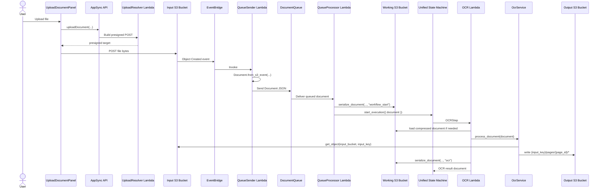

# OCR Flow And S3 Layout Reference

This document describes the non-BDA OCR path in the unified Step Functions workflow, with special focus on how `input_bucket`, `output_bucket`, and `input_key` are set, propagated, and used to derive the final S3 object locations written by OCR.

The analysis in this document is based on the current code in:

- `src/lambda/queue_sender/index.py`
- `src/lambda/queue_processor/index.py`
- `lib/idp_common_pkg/idp_common/models.py`
- `patterns/unified/statemachine/workflow.asl.json`
- `patterns/unified/src/ocr_function/index.py`
- `lib/idp_common_pkg/idp_common/ocr/service.py`
- `patterns/unified/template.yaml`
- `template.yaml`

## Scope

This document covers the standard OCR branch of the unified workflow:

1. File upload to the input bucket
2. Document creation from the S3 event
3. Workflow start and document compression into the working bucket
4. OCR step execution
5. OCR output layout in the output bucket

It does not cover the BDA branch selected when `$.document.use_bda == true`.

## Bucket Configuration

The unified SAM template receives bucket names as deployment-time parameters:

- `InputBucket` in `patterns/unified/template.yaml`
- `WorkingBucket` in `patterns/unified/template.yaml`
- `OutputBucket` in `patterns/unified/template.yaml`

These parameters appear in [template.yaml](../patterns/unified/template.yaml#L18).

The upstream source of truth for the physical bucket names is the root stack:

- the root stack defines the `InputBucket` S3 resource in [template.yaml](../template.yaml#L1627)
- the root stack defines the `WorkingBucket` S3 resource in [template.yaml](../template.yaml#L2207)
- the root stack defines the `OutputBucket` S3 resource in [template.yaml](../template.yaml#L2254)
- the root stack passes those values into the nested unified stack, including `OutputBucket` in [template.yaml](../template.yaml#L1158)

By default, none of these three bucket resources sets an explicit `BucketName`. That means AWS CloudFormation generates the physical S3 bucket names for the stack at deployment time.

### Explicit Bucket Naming Before Deployment

If you want to choose the physical bucket names yourself before deployment, add a `BucketName` property to the corresponding root-stack S3 bucket resource in `template.yaml`.

The places to update are:

- `InputBucket` in [template.yaml](../template.yaml#L1627)
- `WorkingBucket` in [template.yaml](../template.yaml#L2207)
- `OutputBucket` in [template.yaml](../template.yaml#L2254)

For example, each bucket resource would be updated under `Properties:` like this:

```yaml
InputBucket:
  Type: AWS::S3::Bucket
  Properties:
    BucketName: my-input-bucket

WorkingBucket:
  Type: AWS::S3::Bucket
  Properties:
    BucketName: my-working-bucket

OutputBucket:
  Type: AWS::S3::Bucket
  Properties:
    BucketName: my-output-bucket
```

Important notes:

- S3 bucket names must be lowercase and globally unique
- names such as `DocumentOutput` are not valid because uppercase letters are not allowed
- a fixed bucket name may fail if another AWS account already owns it
- because the rest of the stack uses `!Ref InputBucket`, `!Ref WorkingBucket`, and `!Ref OutputBucket`, no other file changes are required if you only want to explicitly name the buckets before deployment

At runtime, their roles are:

- `InputBucket`: stores the originally uploaded document
- `WorkingBucket`: stores compressed `Document` state passed between workflow steps
- `OutputBucket`: stores OCR page artifacts and later downstream processing results

## How `input_bucket`, `output_bucket`, and `input_key` Are Created

The first place these values are assembled into a `Document` is `QueueSender`.

`QueueSender` reads `OUTPUT_BUCKET` from its environment and passes it into `Document.from_s3_event(event, output_bucket)` in [index.py](../src/lambda/queue_sender/index.py#L37).

Inside `Document.from_s3_event(...)`, the document fields are set as follows in [models.py](../lib/idp_common_pkg/idp_common/models.py#L467):

- `input_bucket = event["detail"]["bucket"]["name"]`
- `input_key = event["detail"]["object"]["key"]`
- `output_bucket = <output bucket passed in from QueueSender env>`
- `id = input_key`

So the source of truth is:

- `input_bucket`: the actual bucket that raised the S3 event
- `input_key`: the exact uploaded object key
- `output_bucket`: the deployed output bucket from CloudFormation infrastructure, injected into `QueueSender` via `OUTPUT_BUCKET`

## Sequence Overview



## End-To-End Parameter Flow

### 1. Upload places the source file in the input bucket

The browser uploads the original object to the input bucket via a presigned POST. That uploaded object becomes:

- `input_bucket`: the bucket that received the file
- `input_key`: the exact key used during upload

Nothing in the OCR path renames or normalizes the key later.

### 2. `QueueSender` creates the `Document`

`QueueSender` handles the S3 event and creates the first `Document` instance in [index.py](../src/lambda/queue_sender/index.py#L29).

Important details:

- It reads `OUTPUT_BUCKET` from its Lambda environment, which is wired from `!Ref OutputBucket` in the root stack at [template.yaml](../template.yaml#L3542)
- It calls `Document.from_s3_event(event, output_bucket)`
- The document is persisted and then serialized to SQS with `document.to_json()`

That means `output_bucket` is attached to the document very early and then carried as document state all the way into OCR.

### 3. `QueueProcessor` compresses the document into the working bucket

`QueueProcessor` starts the Step Functions workflow in [index.py](../src/lambda/queue_processor/index.py#L71).

Before starting the workflow, it calls:

```python
document.serialize_document(working_bucket, "workflow_start", logger)
```

The `Document` model compresses the full document JSON into:

`s3://{working_bucket}/compressed_documents/{document.id}/{timestamp}_workflow_start_state.json`

Because `document.id` is set to `input_key`, the compression path is:

`s3://{working_bucket}/compressed_documents/{input_key}/{timestamp}_workflow_start_state.json`

This storage path is defined in [models.py](../lib/idp_common_pkg/idp_common/models.py#L685) and is written with content type `application/json` in [models.py](../lib/idp_common_pkg/idp_common/models.py#L692).

### 4. The state machine routes to OCR

The unified workflow routes to `OCRStep` unless `$.document.use_bda` is `true`, in [workflow.asl.json](../patterns/unified/statemachine/workflow.asl.json#L5).

`OCRStep` passes:

- `execution_arn`
- `document`

and stores the result at `$.OCRResult` in [workflow.asl.json](../patterns/unified/statemachine/workflow.asl.json#L153).

### 5. OCR Lambda reloads the document

The OCR Lambda calls:

```python
document = Document.load_document(event["document"], working_bucket, logger)
```

in [index.py](../patterns/unified/src/ocr_function/index.py#L185).

If the document payload is compressed, `Document.load_document(...)` fetches the full JSON from the working bucket and restores the original fields, including:

- `input_bucket`
- `input_key`
- `output_bucket`

### 6. OCR reads from the input bucket and writes to the output bucket

The OCR service reads the source object with:

```python
self.s3_client.get_object(Bucket=document.input_bucket, Key=document.input_key)
```

in [service.py](../lib/idp_common_pkg/idp_common/ocr/service.py#L323).

It writes OCR artifacts using:

- `output_bucket = document.output_bucket`
- `prefix = document.input_key`

This is visible in:

- [service.py](../lib/idp_common_pkg/idp_common/ocr/service.py#L355)
- [service.py](../lib/idp_common_pkg/idp_common/ocr/service.py#L439)
- [service.py](../lib/idp_common_pkg/idp_common/ocr/service.py#L493)

This is the key derivation rule for all OCR outputs:

- Output bucket name: `document.output_bucket`
- Output prefix: `document.input_key`

So if the uploaded file is:

`s3://my-input-bucket/incoming/batch-7/claim-001.pdf`

then OCR writes to:

`s3://my-output-bucket/incoming/batch-7/claim-001.pdf/pages/...`

The original filename and extension remain part of the output prefix.

## Final S3 Location Formulas

### Source document

`s3://{input_bucket}/{input_key}`

### OCR output root

`s3://{output_bucket}/{input_key}/`

### OCR per-page folder

`s3://{output_bucket}/{input_key}/pages/{page_id}/`

### Compressed workflow state

`s3://{working_bucket}/compressed_documents/{input_key}/{timestamp}_{step_name}_state.json`

## OCR Output Folder Structure

The OCR step writes one folder per page under:

`{input_key}/pages/{page_id}/`

The retry recovery logic in the OCR Lambda explicitly expects this structure in [index.py](../patterns/unified/src/ocr_function/index.py#L108).

### Standard PDF page output

For PDF input, each processed page writes:

- `image.jpg`
- `rawText.json`
- `result.json`
- `textConfidence.json`

The PDF path writes `image.jpg` because pages are rendered to JPEG before OCR in [service.py](../lib/idp_common_pkg/idp_common/ocr/service.py#L999).

### Direct image input nuance

For direct image uploads such as PNG or TIFF, the image file can be written as:

- `image.png`
- `image.jpg`
- `image.tiff`
- other supported extensions

depending on original format and whether conversion occurs in [service.py](../lib/idp_common_pkg/idp_common/ocr/service.py#L634) and [service.py](../lib/idp_common_pkg/idp_common/ocr/service.py#L786).

### Non-PDF document nuance

For `txt`, `csv`, `xlsx`, and `docx`, OCR first converts the document into page images and text, then writes the same per-page structure under `pages/{page_id}/` in [service.py](../lib/idp_common_pkg/idp_common/ocr/service.py#L346) and the downstream page writers referenced from that flow.

## OCR Output Files And Content Types

The shared S3 writer defaults to:

- `application/json` for dicts and lists
- `text/plain` for strings
- `application/octet-stream` for raw bytes

unless a content type is passed explicitly, in [__init__.py](../lib/idp_common_pkg/idp_common/s3/__init__.py#L104).

For OCR outputs, content types are passed explicitly.

| File | Typical key | Content type | Contents |
| --- | --- | --- | --- |
| Page image | `{input_key}/pages/{page_id}/image.jpg` or `image.{ext}` | `image/jpeg`, `image/png`, `image/tiff`, etc. | Rendered PDF page or source image bytes |
| Raw OCR response | `{input_key}/pages/{page_id}/rawText.json` | `application/json` | Raw Textract response, raw Bedrock response, or empty OCR stub |
| Parsed OCR text | `{input_key}/pages/{page_id}/result.json` | `application/json` | Parsed extracted text as `{"text": ...}` |
| Confidence summary | `{input_key}/pages/{page_id}/textConfidence.json` | `application/json` | Markdown table wrapped as `{"text": ...}` |
| Compressed state | `compressed_documents/{input_key}/{timestamp}_{step_name}_state.json` | `application/json` | Full serialized `Document` JSON |

## File Contents By OCR Backend

### `rawText.json`

For the default Textract backend:

- written from `detect_document_text(...)` or `analyze_document(...)`
- contains the raw Textract API response

See [service.py](../lib/idp_common_pkg/idp_common/ocr/service.py#L1102) and [service.py](../lib/idp_common_pkg/idp_common/ocr/service.py#L1645).

For the Bedrock backend:

- contains the raw Bedrock model response payload

For backend `none`:

- contains a compatibility stub with empty blocks

### `result.json`

This file always contains a JSON object with a `text` field.

For Textract:

- OCR tries to convert the parsed result to markdown
- if markdown conversion fails, it falls back to plain text
- if parsing fails completely, it falls back to joining Textract `LINE` blocks

This behavior is implemented in [service.py](../lib/idp_common_pkg/idp_common/ocr/service.py#L1746).

For Bedrock:

- `{"text": "<LLM extracted text>"}`

For backend `none`:

- `{"text": ""}`

For converted non-PDF documents:

- `{"text": "<page_text>"}`

### `textConfidence.json`

This file also stores a JSON object with a `text` field.

For Textract:

- the value is a markdown table containing `LINE` text and confidence values

For Bedrock:

- the value is placeholder markdown saying confidence data is not available from LLM OCR

For backend `none`:

- the value is placeholder markdown saying no OCR was performed

## Retry And Recovery Behavior

OCR includes retry-safe recovery logic. If the OCR step is retried after a throttling failure, the Lambda scans:

`s3://{output_bucket}/{input_key}/pages/`

and reconstructs completed pages if all expected files already exist:

- `image.*`
- `rawText.json`
- `result.json`
- `textConfidence.json`

This logic is implemented in [index.py](../patterns/unified/src/ocr_function/index.py#L108).

That means the folder structure documented here is not just descriptive. It is required for retry resumption.

## Important Accuracy Notes

- The OCR Lambda does not compute `output_bucket` for itself. It uses `document.output_bucket`, which was attached to the `Document` upstream by `QueueSender`.
- The OCR Lambda environment contains `WORKING_BUCKET`, but not `OUTPUT_BUCKET`, in [template.yaml](../patterns/unified/template.yaml#L2388).
- The OCR output prefix is exactly `document.input_key`. If the input key contains folders or ends in `.pdf`, those remain part of the output path.
- `document.id` is initialized to `input_key`, so compressed workflow state also mirrors the input object key hierarchy.

## Key Code References

- [src/lambda/queue_sender/index.py](../src/lambda/queue_sender/index.py)
- [src/lambda/queue_processor/index.py](../src/lambda/queue_processor/index.py)
- [lib/idp_common_pkg/idp_common/models.py](../lib/idp_common_pkg/idp_common/models.py)
- [patterns/unified/statemachine/workflow.asl.json](../patterns/unified/statemachine/workflow.asl.json)
- [patterns/unified/src/ocr_function/index.py](../patterns/unified/src/ocr_function/index.py)
- [lib/idp_common_pkg/idp_common/ocr/service.py](../lib/idp_common_pkg/idp_common/ocr/service.py)
- [patterns/unified/template.yaml](../patterns/unified/template.yaml)
