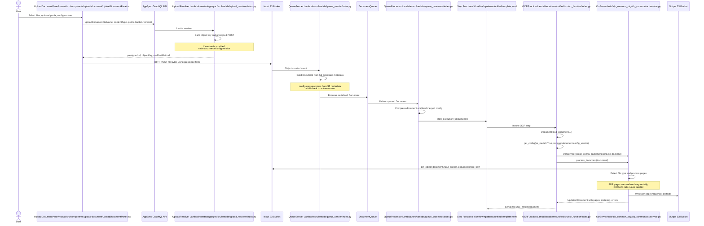

# OCR Sequence High Level

This diagram connects the browser upload entry point in `src/ui/src/components/upload-document/UploadDocumentPanel.tsx` to the OCR implementation in `lib/idp_common_pkg/idp_common/ocr/service.py`.

It focuses on the handoff chain that matters for OCR:

1. `UploadDocumentPanel` asks AppSync for a presigned POST target.
2. The browser uploads the file to the input S3 bucket.
3. S3 eventing pushes the document into the ingestion queue and starts the Step Functions workflow.
4. The workflow invokes `patterns/unified/src/ocr_function/index.py`.
5. `ocr_function` loads config, constructs `ocr.OcrService(...)`, and calls `process_document(document)`.

## Flow Notes

- `UploadDocumentPanel` does not call the OCR service directly. Its responsibility ends after the GraphQL mutation and the browser-side S3 upload.
- The upload resolver also does not perform OCR. It only generates a presigned POST and persists the selected config version into S3 object metadata as `x-amz-meta-config-version`.
- The first backend component that turns the uploaded object into a `Document` is the ingestion path: S3 event -> `queue_sender` -> SQS -> `queue_processor`.
- `queue_processor` is the component that starts the Step Functions workflow, not OCR itself.
- The direct code-level bridge into OCR is `patterns/unified/src/ocr_function/index.py`, where the Lambda:
  - sets `document.status = Status.OCR`
  - loads the effective config for `document.config_version`
  - resolves `backend = config.ocr.backend`
  - constructs `ocr.OcrService(...)`
  - calls `service.process_document(document)`
- `OcrService.process_document(...)` reads the source file from S3, detects the file type, processes PDF/image/non-PDF inputs, populates `document.pages`, merges metering, and marks the document failed if page-level errors accumulate.

## Key Source Files

- `src/ui/src/components/upload-document/UploadDocumentPanel.tsx`
- `nested/appsync/src/lambda/upload_resolver/index.py`
- `src/lambda/queue_sender/index.py`
- `src/lambda/queue_processor/index.py`
- `patterns/unified/src/ocr_function/index.py`
- `lib/idp_common_pkg/idp_common/ocr/service.py`
