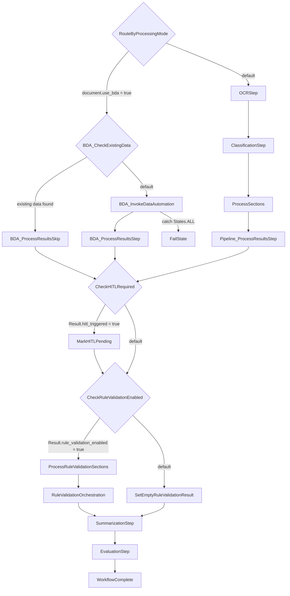

# State Machine Sequence

This document describes the AWS Step Functions workflow defined in `patterns/unified/statemachine/workflow.asl.json`.

## Top-Level Flow

The workflow starts at `RouteByProcessingMode` and then follows one of two branches:

- BDA branch: `RouteByProcessingMode` -> `BDA_CheckExistingData` -> `BDA_InvokeDataAutomation` or `BDA_ProcessResultsSkip` -> `BDA_ProcessResultsStep`
- OCR pipeline branch: `RouteByProcessingMode` -> `OCRStep` -> `ClassificationStep` -> `ProcessSections` -> `Pipeline_ProcessResultsStep`

Both branches converge at:

- `CheckHITLRequired` -> `MarkHITLPending` when HITL is triggered
- `CheckRuleValidationEnabled` -> `ProcessRuleValidationSections` or `SetEmptyRuleValidationResult`
- `RuleValidationOrchestration` -> `SummarizationStep` -> `EvaluationStep` -> `WorkflowComplete`

The explicit failure path currently defined is:

- `BDA_InvokeDataAutomation` -> `FailState` on `States.ALL`

## State Inventory

| State | Type | Next / Outcome | Notes |
| --- | --- | --- | --- |
| `RouteByProcessingMode` | Choice | `BDA_CheckExistingData` or `OCRStep` | Routes by `$.document.use_bda`. |
| `BDA_CheckExistingData` | Choice | `BDA_ProcessResultsSkip` or `BDA_InvokeDataAutomation` | Skips BDA invocation when document data already exists. |
| `BDA_InvokeDataAutomation` | Task | `BDA_ProcessResultsStep` | Invokes the BDA path. Catches `States.ALL` to `FailState`. |
| `BDA_ProcessResultsStep` | Task | `CheckHITLRequired` | Processes BDA output before post-processing gates. |
| `BDA_ProcessResultsSkip` | Task | `CheckHITLRequired` | Normalizes the skip path into the shared post-processing flow. |
| `OCRStep` | Task | `ClassificationStep` | Runs OCR before document classification. |
| `ClassificationStep` | Task | `ProcessSections` | Classifies the document and prepares section work. |
| `ProcessSections` | Map | `Pipeline_ProcessResultsStep` | Runs section-level extraction and assessment in parallel. |
| `Pipeline_ProcessResultsStep` | Task | `CheckHITLRequired` | Consolidates OCR/classification pipeline outputs. |
| `CheckHITLRequired` | Choice | `MarkHITLPending` or `CheckRuleValidationEnabled` | Routes based on `$.Result.hitl_triggered`. |
| `MarkHITLPending` | Pass | `CheckRuleValidationEnabled` | Marks the document as pending HITL and continues. |
| `CheckRuleValidationEnabled` | Choice | `ProcessRuleValidationSections` or `SetEmptyRuleValidationResult` | Routes based on `$.Result.rule_validation_enabled`. |
| `SetEmptyRuleValidationResult` | Pass | `SummarizationStep` | Injects an empty rule validation result when disabled. |
| `ProcessRuleValidationSections` | Map | `RuleValidationOrchestration` | Runs per-section rule validation in parallel. |
| `RuleValidationOrchestration` | Task | `SummarizationStep` | Aggregates or orchestrates rule validation output. |
| `SummarizationStep` | Task | `EvaluationStep` | Produces summary output before evaluation. |
| `EvaluationStep` | Task | `WorkflowComplete` | Performs final evaluation. |
| `WorkflowComplete` | Pass | End | Normal successful termination state. |
| `FailState` | Fail | End | Explicit terminal failure state. |

## Nested Map States

### `ProcessSections`

`ProcessSections` iterates over `$.ClassificationResult.document.sections` with `MaxConcurrency: 10`.

| Nested State | Type | Next / Outcome | Notes |
| --- | --- | --- | --- |
| `ExtractionStep` | Task | `AssessmentStep` | Runs extraction for the current section. |
| `AssessmentStep` | Task | `SectionComplete` | Assesses the extracted section output. |
| `SectionComplete` | Pass | End | Ends the per-section iterator. |

### `ProcessRuleValidationSections`

`ProcessRuleValidationSections` iterates over `$.Result.document.sections` with `MaxConcurrency: 10`.

| Nested State | Type | Next / Outcome | Notes |
| --- | --- | --- | --- |
| `RuleValidationStep` | Task | `RuleValidationSectionComplete` | Runs rule validation for the current section. |
| `RuleValidationSectionComplete` | Pass | End | Ends the per-section rule validation iterator. |
