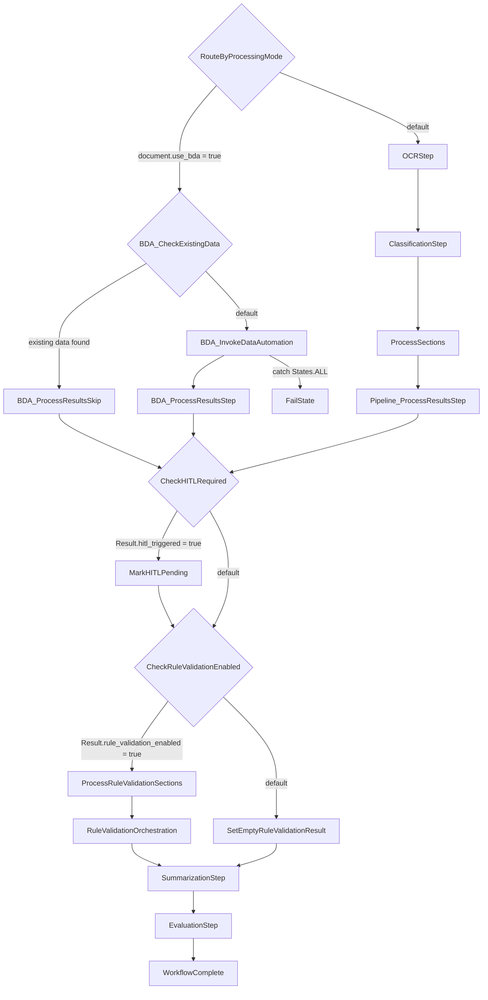

# State Machine Sequence

This document describes the AWS Step Functions workflow defined in `patterns/unified/statemachine/workflow.asl.json`.

## Top-Level Flow

The workflow starts at `RouteByProcessingMode` and then follows one of two branches:

- BDA branch: `RouteByProcessingMode` -> `BDA_CheckExistingData` -> `BDA_InvokeDataAutomation` or `BDA_ProcessResultsSkip` -> `BDA_ProcessResultsStep`
- OCR pipeline branch: `RouteByProcessingMode` -> `OCRStep` -> `ClassificationStep` -> `ProcessSections` -> `Pipeline_ProcessResultsStep`

Both branches converge at:

- `CheckHITLRequired` -> `MarkHITLPending` when HITL is triggered
- `CheckRuleValidationEnabled` -> `ProcessRuleValidationSections` or `SetEmptyRuleValidationResult`
- `RuleValidationOrchestration` -> `SummarizationStep` -> `EvaluationStep` -> `WorkflowComplete`

The explicit failure path currently defined is:

- `BDA_InvokeDataAutomation` -> `FailState` on `States.ALL`

## State Inventory

| State | Type | Next / Outcome | Notes |
| --- | --- | --- | --- |
| `RouteByProcessingMode` | Choice | `BDA_CheckExistingData` or `OCRStep` | Routes by `$.document.use_bda`. |
| `BDA_CheckExistingData` | Choice | `BDA_ProcessResultsSkip` or `BDA_InvokeDataAutomation` | Skips BDA invocation when document data already exists. |
| `BDA_InvokeDataAutomation` | Task | `BDA_ProcessResultsStep` | Invokes the BDA path. Catches `States.ALL` to `FailState`. |
| `BDA_ProcessResultsStep` | Task | `CheckHITLRequired` | Processes BDA output before post-processing gates. |
| `BDA_ProcessResultsSkip` | Task | `CheckHITLRequired` | Normalizes the skip path into the shared post-processing flow. |
| `OCRStep` | Task | `ClassificationStep` | Runs OCR before document classification. |
| `ClassificationStep` | Task | `ProcessSections` | Classifies the document and prepares section work. |
| `ProcessSections` | Map | `Pipeline_ProcessResultsStep` | Runs section-level extraction and assessment in parallel. |
| `Pipeline_ProcessResultsStep` | Task | `CheckHITLRequired` | Consolidates OCR/classification pipeline outputs. |
| `CheckHITLRequired` | Choice | `MarkHITLPending` or `CheckRuleValidationEnabled` | Routes based on `$.Result.hitl_triggered`. |
| `MarkHITLPending` | Pass | `CheckRuleValidationEnabled` | Marks the document as pending HITL and continues. |
| `CheckRuleValidationEnabled` | Choice | `ProcessRuleValidationSections` or `SetEmptyRuleValidationResult` | Routes based on `$.Result.rule_validation_enabled`. |
| `SetEmptyRuleValidationResult` | Pass | `SummarizationStep` | Injects an empty rule validation result when disabled. |
| `ProcessRuleValidationSections` | Map | `RuleValidationOrchestration` | Runs per-section rule validation in parallel. |
| `RuleValidationOrchestration` | Task | `SummarizationStep` | Aggregates or orchestrates rule validation output. |
| `SummarizationStep` | Task | `EvaluationStep` | Produces summary output before evaluation. |
| `EvaluationStep` | Task | `WorkflowComplete` | Performs final evaluation. |
| `WorkflowComplete` | Pass | End | Normal successful termination state. |
| `FailState` | Fail | End | Explicit terminal failure state. |

## Nested Map States

### `ProcessSections`

`ProcessSections` iterates over `$.ClassificationResult.document.sections` with `MaxConcurrency: 10`.

| Nested State | Type | Next / Outcome | Notes |
| --- | --- | --- | --- |
| `ExtractionStep` | Task | `AssessmentStep` | Runs extraction for the current section. |
| `AssessmentStep` | Task | `SectionComplete` | Assesses the extracted section output. |
| `SectionComplete` | Pass | End | Ends the per-section iterator. |

### `ProcessRuleValidationSections`

`ProcessRuleValidationSections` iterates over `$.Result.document.sections` with `MaxConcurrency: 10`.

| Nested State | Type | Next / Outcome | Notes |
| --- | --- | --- | --- |
| `RuleValidationStep` | Task | `RuleValidationSectionComplete` | Runs rule validation for the current section. |
| `RuleValidationSectionComplete` | Pass | End | Ends the per-section rule validation iterator. |

## OCRStep Detail

`OCRStep` is the first task in the OCR pipeline branch. In the state machine definition, it is a `Task` state that invokes `${OCRFunctionArn}`, passes `$$.Execution.Id` as `execution_arn`, passes `$.document` as `document`, stores the response in `$.OCRResult`, and then transitions to `ClassificationStep`.

The ARN placeholder is supplied by the SAM state machine definition in `patterns/unified/template.yaml`:

- `OCRFunctionArn: !GetAtt OCRFunction.Arn`

That means `OCRStep` invokes the Lambda resource with logical ID `OCRFunction`.

### `OCRFunction`

`OCRFunction` is defined in `patterns/unified/template.yaml` as an `AWS::Serverless::Function`. It does not set an explicit `FunctionName`, so CloudFormation generates the deployed physical Lambda name. The same logical ID is also what `sam local invoke OCRFunction` uses during local testing.

Key configuration:

- Packaging: container image Lambda (`PackageType: Image`)
- Image: `${ECRRepository.RepositoryUri}:ocr-function-${ImageVersion}`
- Entrypoint: `index.handler`
- Architecture: `arm64`
- Timeout: `900` seconds
- Memory: `4096` MB
- Tracing: `Active`
- Depends on: `DockerBuildRun`
- SAM build metadata: `SkipBuild: True`

Environment variables:

- `METRIC_NAMESPACE`
- `MAX_WORKERS=20`
- `CONFIGURATION_TABLE_NAME`
- `LOG_LEVEL`
- `APPSYNC_API_URL`
- `TRACKING_TABLE`
- `DOCUMENT_TRACKING_MODE`
- `WORKING_BUCKET`

Primary permissions:

- CloudWatch Logs and basic Lambda execution
- ECR access for the image-based function
- S3 read/write access for input, working, and output buckets
- DynamoDB CRUD access for configuration and tracking tables
- KMS encrypt/decrypt on the customer-managed key
- Textract access:
  - `textract:DetectDocumentText`
  - `textract:AnalyzeDocument`
- Bedrock model invocation permissions
- `lambda:InvokeFunction` for `GENAIIDP-*` functions
- Conditional AppSync GraphQL mutation access when AppSync is enabled

Logging:

- Dedicated log group: `/${AWS::StackName}/lambda/OCRFunction`

Trace summary:

- `OCRStep` in `patterns/unified/statemachine/workflow.asl.json`
- `${OCRFunctionArn}` from state machine `DefinitionSubstitutions`
- `!GetAtt OCRFunction.Arn`
- `OCRFunction` resource in `patterns/unified/template.yaml`

## ClassificationStep Detail

`ClassificationStep` is the second task in the OCR pipeline branch. In the state machine definition, it is a `Task` state that invokes `${ClassificationFunctionArn}`, passes `$$.Execution.Id` as `execution_arn`, passes `$.OCRResult` as `OCRResult`, stores the response in `$.ClassificationResult`, and then transitions to `ProcessSections`.

The state has the same Step Functions retry profile as `OCRStep` for transient Lambda and throttling failures, including `Sandbox.Timedout`, `Lambda.ServiceException`, `Lambda.AWSLambdaException`, `Lambda.SdkClientException`, `Lambda.TooManyRequestsException`, `ServiceQuotaExceededException`, `ThrottlingException`, `ProvisionedThroughputExceededException`, `RequestLimitExceeded`, and `ServiceUnavailableException`.

The ARN placeholder is supplied by the SAM state machine definition in `patterns/unified/template.yaml`:

- `ClassificationFunctionArn: !GetAtt ClassificationFunction.Arn`

That means `ClassificationStep` invokes the Lambda resource with logical ID `ClassificationFunction`.

### `ClassificationFunction`

`ClassificationFunction` is defined in `patterns/unified/template.yaml` as an `AWS::Serverless::Function`. It does not set an explicit `FunctionName`, so CloudFormation generates the deployed physical Lambda name. The same logical ID is also what `sam local invoke ClassificationFunction` uses during local testing.

Key configuration:

- Packaging: container image Lambda (`PackageType: Image`)
- Image: `${ECRRepository.RepositoryUri}:classification-function-${ImageVersion}`
- Entrypoint: `index.handler` in patterns/unified/src/classification_function/index.py
- Architecture: `arm64`
- Timeout: `900` seconds
- Memory: `4096` MB
- Tracing: `Active`
- Depends on: `DockerBuildRun`
- SAM build metadata: `SkipBuild: True`

Environment variables:

- `METRIC_NAMESPACE`
- `MAX_WORKERS=20`
- `TRACKING_TABLE`
- `CONFIGURATION_BUCKET`
- `CONFIGURATION_TABLE_NAME`
- `LOG_LEVEL`
- `APPSYNC_API_URL`
- `DOCUMENT_TRACKING_MODE`
- `WORKING_BUCKET`

Primary permissions:

- CloudWatch Logs and basic Lambda execution
- ECR access for the image-based function
- S3 read access for input and configuration buckets
- S3 read/write access for working and output buckets
- DynamoDB CRUD access for tracking and configuration tables
- KMS encrypt/decrypt on the customer-managed key
- Bedrock model invocation permissions for foundation models and inference profiles
- `lambda:InvokeFunction` for `GENAIIDP-*` functions when classification is configured to use `LambdaHook`
- Conditional AppSync GraphQL mutation access when AppSync is enabled
- Optional `bedrock:ApplyGuardrail` permission when guardrails are configured, although the template notes that guardrails are not enabled for the classification runtime by default

Logging:

- Dedicated log group: `/${AWS::StackName}/lambda/ClassificationFunction`

### Runtime Behavior

The handler implementation lives in `patterns/unified/src/classification_function/index.py`. At runtime it:

- Loads the `Document` from `event["OCRResult"]["document"]`, including support for the serialized/compressed document representation used between steps
- Loads the active configuration, or a version-specific configuration when the document carries `config_version`
- Updates document tracking state to `CLASSIFYING` and records the Step Functions execution ARN
- Instantiates `idp_common.classification.ClassificationService`
- Calls `classify_document(document)` to populate page classifications and document sections
- Persists the updated document so classification results are visible before extraction begins
- Returns a serialized document payload in `$.ClassificationResult.document`

There is also a built-in skip path in the Lambda implementation. If every page already has a classification, the function does not rerun inference; it only updates tracking metadata, records Lambda metering, and returns the existing document structure.

If classification fails for the whole document, or if the service reports page-level failures in `document.metadata.failed_page_exceptions`, the handler updates document tracking and raises an exception. In the state machine, that exception is handled by the `Retry` policy on `ClassificationStep`; unlike the BDA invocation path, there is no explicit `Catch` branch here.

### Configuration That Changes Classification Output

The `classification` block in `patterns/unified/template.yaml` exposes the main knobs that affect what `ProcessSections` receives:

- `model`: Bedrock model ID or `LambdaHook`
- `classificationMethod`: `multimodalPageLevelClassification` or `textbasedHolisticClassification`
- `maxPagesForClassification`: limits how many pages are considered, or uses `ALL`
- `sectionSplitting`: `disabled`, `page`, or `llm_determined`
- `contextPagesCount`: surrounding page context for multimodal page-level classification
- `temperature`, `top_k`, `top_p`, `max_tokens`
- `system_prompt` and `task_prompt`
- Image sizing options under `classification.image`

Operationally, the most important downstream field is `document.sections`:

- `sectionSplitting: disabled` produces a single section for the entire document
- `sectionSplitting: page` produces one section per page
- `sectionSplitting: llm_determined` uses boundary signals from classification to create variable-length sections

That output is consumed immediately by `ProcessSections`, whose `ItemsPath` is `$.ClassificationResult.document.sections`.

Trace summary:

- `ClassificationStep` in `patterns/unified/statemachine/workflow.asl.json`
- `${ClassificationFunctionArn}` from state machine `DefinitionSubstitutions`
- `!GetAtt ClassificationFunction.Arn`
- `ClassificationFunction` resource in `patterns/unified/template.yaml`
- Handler implementation in `patterns/unified/src/classification_function/index.py`

