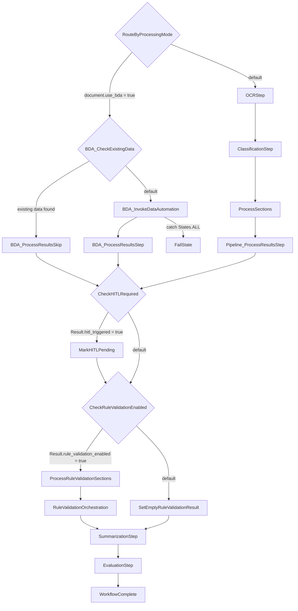

# State Machine Sequence

This document describes the AWS Step Functions workflow defined in `patterns/unified/statemachine/workflow.asl.json`.

## Top-Level Flow

The workflow starts at `RouteByProcessingMode` and then follows one of two branches:

- BDA branch: `RouteByProcessingMode` -> `BDA_CheckExistingData` -> `BDA_InvokeDataAutomation` or `BDA_ProcessResultsSkip` -> `BDA_ProcessResultsStep`
- OCR pipeline branch: `RouteByProcessingMode` -> `OCRStep` -> `ClassificationStep` -> `ProcessSections` -> `Pipeline_ProcessResultsStep`

Both branches converge at:

- `CheckHITLRequired` -> `MarkHITLPending` when HITL is triggered
- `CheckRuleValidationEnabled` -> `ProcessRuleValidationSections` or `SetEmptyRuleValidationResult`
- `RuleValidationOrchestration` -> `SummarizationStep` -> `EvaluationStep` -> `WorkflowComplete`

The explicit failure path currently defined is:

- `BDA_InvokeDataAutomation` -> `FailState` on `States.ALL`



## State Inventory

| State | Type | Next / Outcome | Notes |
| --- | --- | --- | --- |
| `RouteByProcessingMode` | Choice | `BDA_CheckExistingData` or `OCRStep` | Routes by `$.document.use_bda`. |
| `BDA_CheckExistingData` | Choice | `BDA_ProcessResultsSkip` or `BDA_InvokeDataAutomation` | Skips BDA invocation when document data already exists. |
| `BDA_InvokeDataAutomation` | Task | `BDA_ProcessResultsStep` | Invokes the BDA path. Catches `States.ALL` to `FailState`. |
| `BDA_ProcessResultsStep` | Task | `CheckHITLRequired` | Processes BDA output before post-processing gates. |
| `BDA_ProcessResultsSkip` | Task | `CheckHITLRequired` | Normalizes the skip path into the shared post-processing flow. |
| `OCRStep` | Task | `ClassificationStep` | Runs OCR before document classification. |
| `ClassificationStep` | Task | `ProcessSections` | Classifies the document and prepares section work. |
| `ProcessSections` | Map | `Pipeline_ProcessResultsStep` | Runs section-level extraction and assessment in parallel. |
| `Pipeline_ProcessResultsStep` | Task | `CheckHITLRequired` | Consolidates OCR/classification pipeline outputs. |
| `CheckHITLRequired` | Choice | `MarkHITLPending` or `CheckRuleValidationEnabled` | Routes based on `$.Result.hitl_triggered`. |
| `MarkHITLPending` | Pass | `CheckRuleValidationEnabled` | Marks the document as pending HITL and continues. |
| `CheckRuleValidationEnabled` | Choice | `ProcessRuleValidationSections` or `SetEmptyRuleValidationResult` | Routes based on `$.Result.rule_validation_enabled`. |
| `SetEmptyRuleValidationResult` | Pass | `SummarizationStep` | Injects an empty rule validation result when disabled. |
| `ProcessRuleValidationSections` | Map | `RuleValidationOrchestration` | Runs per-section rule validation in parallel. |
| `RuleValidationOrchestration` | Task | `SummarizationStep` | Aggregates or orchestrates rule validation output. |
| `SummarizationStep` | Task | `EvaluationStep` | Produces summary output before evaluation. |
| `EvaluationStep` | Task | `WorkflowComplete` | Performs final evaluation. |
| `WorkflowComplete` | Pass | End | Normal successful termination state. |
| `FailState` | Fail | End | Explicit terminal failure state. |

## Nested Map States

### `ProcessSections`

`ProcessSections` iterates over `$.ClassificationResult.document.sections` with `MaxConcurrency: 10`.

| Nested State | Type | Next / Outcome | Notes |
| --- | --- | --- | --- |
| `ExtractionStep` | Task | `AssessmentStep` | Runs extraction for the current section. |
| `AssessmentStep` | Task | `SectionComplete` | Assesses the extracted section output. |
| `SectionComplete` | Pass | End | Ends the per-section iterator. |

### `ProcessRuleValidationSections`

`ProcessRuleValidationSections` iterates over `$.Result.document.sections` with `MaxConcurrency: 10`.

| Nested State | Type | Next / Outcome | Notes |
| --- | --- | --- | --- |
| `RuleValidationStep` | Task | `RuleValidationSectionComplete` | Runs rule validation for the current section. |
| `RuleValidationSectionComplete` | Pass | End | Ends the per-section rule validation iterator. |

## OCR-Branch - OCRStep Detail

`OCRStep` is the first task in the OCR pipeline branch. In the state machine definition, it is a `Task` state that invokes `${OCRFunctionArn}`, passes `$$.Execution.Id` as `execution_arn`, passes `$.document` as `document`, stores the response in `$.OCRResult`, and then transitions to `ClassificationStep`.

The ARN placeholder is supplied by the SAM state machine definition in `patterns/unified/template.yaml`:

- `OCRFunctionArn: !GetAtt OCRFunction.Arn`

That means `OCRStep` invokes the Lambda resource with logical ID `OCRFunction`.

### `OCRFunction`

`OCRFunction` is defined in `patterns/unified/template.yaml` as an `AWS::Serverless::Function`. It does not set an explicit `FunctionName`, so CloudFormation generates the deployed physical Lambda name. The same logical ID is also what `sam local invoke OCRFunction` uses during local testing.

Key configuration:

- Packaging: container image Lambda (`PackageType: Image`)
- Image: `${ECRRepository.RepositoryUri}:ocr-function-${ImageVersion}`
- Entrypoint: `index.handler`
- Architecture: `arm64`
- Timeout: `900` seconds
- Memory: `4096` MB
- Tracing: `Active`
- Depends on: `DockerBuildRun`
- SAM build metadata: `SkipBuild: True`

Environment variables:

- `METRIC_NAMESPACE`
- `MAX_WORKERS=20`
- `CONFIGURATION_TABLE_NAME`
- `LOG_LEVEL`
- `APPSYNC_API_URL`
- `TRACKING_TABLE`
- `DOCUMENT_TRACKING_MODE`
- `WORKING_BUCKET`

Primary permissions:

- CloudWatch Logs and basic Lambda execution
- ECR access for the image-based function
- S3 read/write access for input, working, and output buckets
- DynamoDB CRUD access for configuration and tracking tables
- KMS encrypt/decrypt on the customer-managed key
- Textract access:
  - `textract:DetectDocumentText`
  - `textract:AnalyzeDocument`
- Bedrock model invocation permissions
- `lambda:InvokeFunction` for `GENAIIDP-*` functions
- Conditional AppSync GraphQL mutation access when AppSync is enabled

Logging:

- Dedicated log group: `/${AWS::StackName}/lambda/OCRFunction`

Trace summary:

- `OCRStep` in `patterns/unified/statemachine/workflow.asl.json`
- `${OCRFunctionArn}` from state machine `DefinitionSubstitutions`
- `!GetAtt OCRFunction.Arn`
- `OCRFunction` resource in `patterns/unified/template.yaml`

## OCR-Branch - ClassificationStep Detail

`ClassificationStep` is the second task in the OCR pipeline branch. In the state machine definition, it is a `Task` state that invokes `${ClassificationFunctionArn}`, passes `$$.Execution.Id` as `execution_arn`, passes `$.OCRResult` as `OCRResult`, stores the response in `$.ClassificationResult`, and then transitions to `ProcessSections`.

The state has the same Step Functions retry profile as `OCRStep` for transient Lambda and throttling failures, including `Sandbox.Timedout`, `Lambda.ServiceException`, `Lambda.AWSLambdaException`, `Lambda.SdkClientException`, `Lambda.TooManyRequestsException`, `ServiceQuotaExceededException`, `ThrottlingException`, `ProvisionedThroughputExceededException`, `RequestLimitExceeded`, and `ServiceUnavailableException`.

The ARN placeholder is supplied by the SAM state machine definition in `patterns/unified/template.yaml`:

- `ClassificationFunctionArn: !GetAtt ClassificationFunction.Arn`

That means `ClassificationStep` invokes the Lambda resource with logical ID `ClassificationFunction`.

### `ClassificationFunction`

`ClassificationFunction` is defined in `patterns/unified/template.yaml` as an `AWS::Serverless::Function`. It does not set an explicit `FunctionName`, so CloudFormation generates the deployed physical Lambda name. The same logical ID is also what `sam local invoke ClassificationFunction` uses during local testing.

Key configuration:

- Packaging: container image Lambda (`PackageType: Image`)
- Image: `${ECRRepository.RepositoryUri}:classification-function-${ImageVersion}`
- Entrypoint: `index.handler` in patterns/unified/src/classification_function/index.py
- Architecture: `arm64`
- Timeout: `900` seconds
- Memory: `4096` MB
- Tracing: `Active`
- Depends on: `DockerBuildRun`
- SAM build metadata: `SkipBuild: True`

Environment variables:

- `METRIC_NAMESPACE`
- `MAX_WORKERS=20`
- `TRACKING_TABLE`
- `CONFIGURATION_BUCKET`
- `CONFIGURATION_TABLE_NAME`
- `LOG_LEVEL`
- `APPSYNC_API_URL`
- `DOCUMENT_TRACKING_MODE`
- `WORKING_BUCKET`

Primary permissions:

- CloudWatch Logs and basic Lambda execution
- ECR access for the image-based function
- S3 read access for input and configuration buckets
- S3 read/write access for working and output buckets
- DynamoDB CRUD access for tracking and configuration tables
- KMS encrypt/decrypt on the customer-managed key
- Bedrock model invocation permissions for foundation models and inference profiles
- `lambda:InvokeFunction` for `GENAIIDP-*` functions when classification is configured to use `LambdaHook`
- Conditional AppSync GraphQL mutation access when AppSync is enabled
- Optional `bedrock:ApplyGuardrail` permission when guardrails are configured, although the template notes that guardrails are not enabled for the classification runtime by default

Logging:

- Dedicated log group: `/${AWS::StackName}/lambda/ClassificationFunction`

### Runtime Behavior

The handler implementation lives in `patterns/unified/src/classification_function/index.py`. At runtime it:

- Loads the `Document` from `event["OCRResult"]["document"]`, including support for the serialized/compressed document representation used between steps
- Loads the active configuration, or a version-specific configuration when the document carries `config_version`
- Updates document tracking state to `CLASSIFYING` and records the Step Functions execution ARN
- Instantiates `idp_common.classification.ClassificationService`
- Calls `classify_document(document)` to populate page classifications and document sections
- Persists the updated document so classification results are visible before extraction begins
- Returns a serialized document payload in `$.ClassificationResult.document`

There is also a built-in skip path in the Lambda implementation. If every page already has a classification, the function does not rerun inference; it only updates tracking metadata, records Lambda metering, and returns the existing document structure.

If classification fails for the whole document, or if the service reports page-level failures in `document.metadata.failed_page_exceptions`, the handler updates document tracking and raises an exception. In the state machine, that exception is handled by the `Retry` policy on `ClassificationStep`; unlike the BDA invocation path, there is no explicit `Catch` branch here.

### Configuration That Changes Classification Output

The `classification` block in `patterns/unified/template.yaml` exposes the main knobs that affect what `ProcessSections` receives:

- `model`: Bedrock model ID or `LambdaHook`
- `classificationMethod`: `multimodalPageLevelClassification` or `textbasedHolisticClassification`
- `maxPagesForClassification`: limits how many pages are considered, or uses `ALL`
- `sectionSplitting`: `disabled`, `page`, or `llm_determined`
- `contextPagesCount`: surrounding page context for multimodal page-level classification
- `temperature`, `top_k`, `top_p`, `max_tokens`
- `system_prompt` and `task_prompt`
- Image sizing options under `classification.image`

Operationally, the most important downstream field is `document.sections`:

- `sectionSplitting: disabled` produces a single section for the entire document
- `sectionSplitting: page` produces one section per page
- `sectionSplitting: llm_determined` uses boundary signals from classification to create variable-length sections

That output is consumed immediately by `ProcessSections`, whose `ItemsPath` is `$.ClassificationResult.document.sections`.

Trace summary:

- `ClassificationStep` in `patterns/unified/statemachine/workflow.asl.json`
- `${ClassificationFunctionArn}` from state machine `DefinitionSubstitutions`
- `!GetAtt ClassificationFunction.Arn`
- `ClassificationFunction` resource in `patterns/unified/template.yaml`
- Handler implementation in `patterns/unified/src/classification_function/index.py`

## OCR-Branch - ProcessSections Detail

`ProcessSections` is the section-level fan-out stage for the OCR pipeline. In the state machine definition it is a `Map` state with:

- `ItemsPath: $.ClassificationResult.document.sections`
- `MaxConcurrency: 10`
- `ItemSelector` that builds one iterator input per section:
  - `execution_arn` from `$$.Execution.Id`
  - `document` from `$.ClassificationResult.document`
  - `section_id` from `$$.Map.Item.Value`

One subtle but important implementation detail is that the map item is treated as a section identifier, not a full section object. Each iterator receives the full classified document plus the current `section_id`, and the Lambdas look up the matching section inside `document.sections`.

Within each iterator, the sequence is:

- `ExtractionStep` invokes `${ExtractionFunctionArn}`
- `AssessmentStep` invokes `${AssessmentFunctionArn}`
- `SectionComplete` ends the iterator

Both task states use the same retry profile:

- Errors: `Sandbox.Timedout`, `Lambda.ServiceException`, `Lambda.AWSLambdaException`, `Lambda.SdkClientException`, `Lambda.TooManyRequestsException`, `ServiceQuotaExceededException`, `ThrottlingException`, `ProvisionedThroughputExceededException`, `RequestLimitExceeded`, `ServiceUnavailableException`
- `IntervalSeconds: 10`
- `MaxAttempts: 8`
- `BackoffRate: 2.5`

Unlike the BDA path, `ProcessSections` does not define a `Catch` branch. If a section exhausts retries, the map fails and the workflow does not advance to `Pipeline_ProcessResultsStep`.

### Iterator Input And Output Shape

The map iterator starts with an input shaped like:

```json
{
  "execution_arn": "...",
  "document": { "...": "classified document payload" },
  "section_id": "3"
}
```

`ExtractionStep` returns:

```json
{
  "section_id": "3",
  "document": { "...": "document payload scoped to the processed section" }
}
```

`AssessmentStep` explicitly rebuilds its input from that output using `Parameters`, keeps the result at `ResultPath: "$"`, and returns the same top-level shape. Operationally, that means each iterator always carries forward the latest section-scoped document emitted by the previous task.

### `ExtractionStep`

`ExtractionStep` invokes `ExtractionFunction`, defined in `patterns/unified/template.yaml` as an image-based Lambda:

- Image: `${ECRRepository.RepositoryUri}:extraction-function-${ImageVersion}`
- Entrypoint: `index.handler` in `patterns/unified/src/extraction_function/index.py`
- Architecture: `arm64`
- Timeout: `900` seconds
- Memory: `4096` MB
- Tracing: `Active`

Key environment variables:

- `CONFIGURATION_BUCKET`
- `CONFIGURATION_TABLE_NAME`
- `TRACKING_TABLE`
- `WORKING_BUCKET`
- `APPSYNC_API_URL`
- `DOCUMENT_TRACKING_MODE`
- `LOG_LEVEL`

Runtime behavior from `patterns/unified/src/extraction_function/index.py`:

- Loads the classified document, including compressed/serialized document payloads
- Loads the active configuration, or a version-specific configuration from `document.config_version`
- Looks up the current section by `section_id`
- Skips extraction if the section already has `extraction_result_uri`
- Otherwise marks the document status as `EXTRACTING`
- Narrows the in-memory document to the single target section and only that section's pages
- Calls `ExtractionService.process_document_section(document, section_id)`
- Persists the updated section back to the tracking store with `update_document_section(...)` so the UI can see extraction output before the whole map completes
- Returns a serialized section-scoped document payload

The skip path matters for reprocessing and resume scenarios. If a section already has extraction output, `ExtractionFunction` does not rerun inference; it simply returns the current document state and still records Lambda metering.

### `AssessmentStep`

`AssessmentStep` invokes `AssessmentFunction`, also defined in `patterns/unified/template.yaml` as an image-based Lambda with the same runtime envelope:

- Image: `${ECRRepository.RepositoryUri}:assessment-function-${ImageVersion}`
- Entrypoint: `index.handler`
- Architecture: `arm64`
- Timeout: `900` seconds
- Memory: `4096` MB
- Tracing: `Active`

Key environment variables:

- `CONFIGURATION_BUCKET`
- `CONFIGURATION_TABLE_NAME`
- `TRACKING_TABLE`
- `WORKING_BUCKET`
- `APPSYNC_API_URL`
- `DOCUMENT_TRACKING_MODE`
- `LOG_LEVEL`

Runtime behavior from `patterns/unified/src/assessment_function/index.py`:

- Loads the section-scoped document produced by extraction
- Reloads configuration, including version-specific configuration when present
- Looks up the section by `section_id`
- Checks whether the extraction output already contains `explainability_info`; if so, it skips assessment and returns the existing result
- Otherwise marks the document status as `ASSESSING`
- Uses either `AssessmentService` or `GranularAssessmentService`, depending on `config.assessment.granular.enabled`
- Runs `process_document_section(document, section_id)`
- Detects throttling-related failures and re-raises them as `ThrottlingException` so the Step Functions retry policy is used
- Optionally runs `AssessmentValidator` when granular assessment validation is enabled
- Persists the updated section back to the tracking store with `update_document_section(...)`
- Returns a serialized section-scoped document payload

Assessment has more explicit retry integration than extraction. The handler inspects exceptions and document error content for throttling signals such as `TooManyRequestsException`, `ProvisionedThroughputExceededException`, and token-rate-limit style messages. When it detects those conditions it raises `ThrottlingException`, which is one of the explicit retryable errors listed on the `AssessmentStep` state.

### Operational Result

By the time `ProcessSections` finishes successfully:

- every section has gone through extraction and assessment, or has been skipped because equivalent output already existed
- section-level results have already been persisted incrementally to the document tracking store
- the workflow has a map result array containing one `{section_id, document}` object per processed section

The next state, `Pipeline_ProcessResultsStep`, is responsible for collapsing those per-section outputs back into the shared pipeline result shape used by the rest of the workflow.

##  OCR-Branch - Pipeline_ProcessResultsStep Detail

`Pipeline_ProcessResultsStep` is the post-map consolidation task for the OCR pipeline branch. In the state machine definition, it is a `Task` state that invokes `${PipelineProcessResultsLambdaArn}`, passes:

- `$$.Execution.Id` as `execution_arn`
- `$.ClassificationResult` as `ClassificationResult`
- `$.ExtractionResults` as `ExtractionResults`

The state stores the Lambda response in `$.Result` and then transitions to `CheckHITLRequired`.

Like the earlier OCR branch tasks, it has an explicit retry policy for transient Lambda and throttling failures:

- Errors: `Sandbox.Timedout`, `Lambda.ServiceException`, `Lambda.AWSLambdaException`, `Lambda.SdkClientException`, `Lambda.TooManyRequestsException`, `ServiceQuotaExceededException`, `ThrottlingException`, `ProvisionedThroughputExceededException`, `RequestLimitExceeded`, `ServiceUnavailableException`
- `IntervalSeconds: 10`
- `MaxAttempts: 8`
- `BackoffRate: 2.5`

The ARN placeholder is supplied by the SAM state machine definition in `patterns/unified/template.yaml`:

- `PipelineProcessResultsLambdaArn: !GetAtt ProcessResultsFunction.Arn`

That means `Pipeline_ProcessResultsStep` invokes the Lambda resource with logical ID `ProcessResultsFunction`.

### `ProcessResultsFunction`

`ProcessResultsFunction` is defined in `patterns/unified/template.yaml` as an `AWS::Serverless::Function`. It does not set an explicit `FunctionName`, so CloudFormation generates the deployed physical Lambda name. The same logical ID is also what `sam local invoke ProcessResultsFunction` uses during local testing.

Key configuration:

- Packaging: container image Lambda (`PackageType: Image`)
- Image: `${ECRRepository.RepositoryUri}:processresults-function-${ImageVersion}`
- Entrypoint: `index.handler` in `patterns/unified/src/processresults_function/index.py`
- Architecture: `arm64`
- Timeout: `900` seconds
- Memory: `4096` MB
- Depends on: `DockerBuildRun`
- SAM build metadata: `SkipBuild: True`

Environment variables:

- `METRIC_NAMESPACE`
- `LOG_LEVEL`
- `APPSYNC_API_URL`
- `TRACKING_TABLE`
- `DOCUMENT_TRACKING_MODE`
- `WORKING_BUCKET`
- `OUTPUT_BUCKET`
- `CONFIGURATION_TABLE_NAME`

Primary permissions:

- CloudWatch Logs and basic Lambda execution
- ECR access for the image-based function
- S3 read access for the input bucket
- S3 read/write access for the working and output buckets
- DynamoDB CRUD access for tracking and configuration tables
- KMS encrypt/decrypt on the customer-managed key
- Conditional AppSync GraphQL query/mutation access when AppSync is enabled

Logging:

- Dedicated log group: `/${AWS::StackName}/lambda/ProcessResultsFunction`

### Runtime Behavior

The handler implementation lives in `patterns/unified/src/processresults_function/index.py`. At runtime it:

- Loads the base document from `event["ClassificationResult"]["document"]`, including support for serialized/compressed document payloads
- Reloads configuration, using `document.config_version` when present
- Reads `event["ExtractionResults"]`, which is the completed `Map` output from `ProcessSections`
- Sets the document status to `POSTPROCESSING`
- Creates a document service via `create_document_service()` and immediately persists the status update
- Reloads the current document record from the tracking store so any existing reviewer-driven `hitl_status` is preserved during reprocessing
- Clears `document.sections` and rebuilds it from the per-section documents returned by the map
- Merges per-section metering into the final document with `utils.merge_metering_data(...)`
- Creates S3 sidecar metadata files for each section extraction result and each page raw-text artifact
- Computes HITL metadata and confidence-alert totals across all sections
- Updates the final consolidated document back into the tracking store
- Returns a serialized document payload plus branch-control flags used by later Choice states

The rebuild step is important. `ProcessSections` fans out one section at a time and each iterator returns a document payload scoped to that section. `ProcessResultsFunction` treats those as partial outputs, takes the first section from each returned document, and appends it back onto the original classified document so downstream states see one unified `document`.

### HITL Handling

This step is where the OCR branch decides whether the workflow should mark the document for human review.

For each rebuilt section, the function evaluates this condition:

```python
if hitl_enabled and section.confidence_threshold_alerts:
```

That means a section only contributes to HITL state when both of these are true:

- `is_hitl_enabled(config_version)` returned `True`
- `section.confidence_threshold_alerts` is non-empty after assessment

When the condition matches, the code does three immediate things inside the section loop:

```python
hitl_triggered = True

section_page_numbers = list(range(1, len(section.page_ids) + 1))
hitl_metadata = HitlMetadata(
    execution_id=execution_id,
    record_number=int(section.section_id),
    bp_match=True,
    extraction_bp_name=section.classification,
    hitl_triggered=True,
    page_array=section_page_numbers,
)
document.hitl_metadata.append(hitl_metadata)
```

Field-by-field, that `HitlMetadata` object is populated as follows:

- `execution_id`: derived from the Step Functions execution ARN and used to link the review item back to the workflow run
- `record_number`: the section identifier converted to `int`
- `bp_match=True`: hard-coded to indicate the section matched a business-process/classification path
- `extraction_bp_name`: copied from `section.classification`
- `hitl_triggered=True`: explicit marker that this record requires review
- `page_array`: a 1-based page-number list built from `section.page_ids`

After the section loop finishes, the function converts that per-section signal into document-level pending-review state:

```python
hitl_sections_pending = []
if hitl_triggered:
    document.hitl_triggered = True
    existing_status = document.hitl_status
    if existing_status not in ("Review Completed", "Review Skipped", "Completed", "Skipped"):
        for section in document.sections:
            if section.confidence_threshold_alerts:
                hitl_sections_pending.append(section.section_id)
        document.hitl_status = "PendingReview"
        document.hitl_sections_pending = hitl_sections_pending
        document.hitl_sections_completed = []
```

That block does four important things:

- promotes the local boolean into the persisted document field `document.hitl_triggered`
- preserves an existing terminal review state on reprocessing by checking `document.hitl_status`
- rebuilds `document.hitl_sections_pending` from every section that still has confidence alerts
- resets `document.hitl_sections_completed` to an empty list when the document is newly marked for review

The preservation logic matters on reruns. If the document already has one of these statuses, the function does not overwrite it with `PendingReview`:

- `Review Completed`
- `Review Skipped`
- `Completed`
- `Skipped`

So the effective behavior is:

- new low-confidence sections -> mark the document `PendingReview`
- low-confidence sections on an already-reviewed document -> keep the existing review outcome
- no low-confidence sections -> leave `hitl_triggered` false and do not populate pending-review fields

That behavior lines up with the next state in the workflow:

- `CheckHITLRequired` branches on `$.Result.hitl_triggered`
- if `true`, the workflow goes to `MarkHITLPending`
- if `false`, it goes directly to `CheckRuleValidationEnabled`

Operationally, `MarkHITLPending` does not wait for a reviewer. It is only a pass-through marker state; the workflow continues asynchronously into the remaining post-processing steps.

### Rule Validation Gating

`ProcessResultsFunction` also decides whether rule validation should run. It reads `config.rule_validation.enabled`, then additionally verifies that `config.rule_classes` is non-empty. If rule validation is enabled in config but no rule classes are defined, it explicitly disables the branch.

That result is returned as `rule_validation_enabled`, which the next choice state uses:

- `CheckRuleValidationEnabled` branches on `$.Result.rule_validation_enabled`
- if `true`, the workflow enters `ProcessRuleValidationSections`
- if `false`, it skips directly to `SetEmptyRuleValidationResult`

### Success Output Shape

On success, the Lambda returns a payload shaped like:

```json
{
  "document": { "...": "serialized consolidated document" },
  "hitl_triggered": true,
  "rule_validation_enabled": false
}
```

The exact boolean values depend on section confidence alerts and configuration, but this response shape is stable and is the shared contract consumed by `CheckHITLRequired` and `CheckRuleValidationEnabled`.

### Failure Semantics

The consolidation step is also where section-level failures are surfaced as a workflow-level failure.

- If a returned section document has `status == FAILED`, its errors are accumulated
- If the consolidated document itself contains errors, those are appended as well
- After building the response, the function raises an exception when any validation errors were collected

Because `Pipeline_ProcessResultsStep` has retries but no `Catch` branch, exhausting retries fails the state machine execution rather than routing into an alternate recovery path.

### Operational Result

By the time `Pipeline_ProcessResultsStep` finishes successfully:

- the OCR branch has been collapsed from per-section map outputs back into one document payload
- all sections are present on `$.Result.document.sections`
- document status has been advanced to `POSTPROCESSING`
- HITL metadata and pending-review state, if any, have been derived from assessment confidence alerts
- rule-validation eligibility has been computed for the next branch

Trace summary:

- `Pipeline_ProcessResultsStep` in `patterns/unified/statemachine/workflow.asl.json`
- `${PipelineProcessResultsLambdaArn}` from state machine `DefinitionSubstitutions`
- `!GetAtt ProcessResultsFunction.Arn`
- `ProcessResultsFunction` resource in `patterns/unified/template.yaml`
- Handler implementation in `patterns/unified/src/processresults_function/index.py`

##  BDA-Branch - BDA_CheckExistingData Detail

`BDA_CheckExistingData` is the first decision point inside the BDA branch. In the state machine definition, it is a `Choice` state whose job is to detect reprocessing scenarios where the incoming `document` already contains page and section structure, so the workflow can skip the expensive BDA invocation.

The state comment in `patterns/unified/statemachine/workflow.asl.json` is:

- `Check if document already has pages/sections data (reprocessing scenario)`

### Choice Logic

`BDA_CheckExistingData` has two explicit skip conditions and one default path.

It routes to `BDA_ProcessResultsSkip` when either of these is true:

1. The document already has pages and `sections[0]` is a string
2. The document already has pages and `sections[0].section_id` is present

In ASL terms, those branches are:

```json
{
  "And": [
    { "Variable": "$.document.num_pages", "NumericGreaterThan": 0 },
    { "Variable": "$.document.sections[0]", "IsString": true }
  ],
  "Next": "BDA_ProcessResultsSkip"
}
```

and:

```json
{
  "And": [
    { "Variable": "$.document.num_pages", "NumericGreaterThan": 0 },
    { "Variable": "$.document.sections[0].section_id", "IsPresent": true }
  ],
  "Next": "BDA_ProcessResultsSkip"
}
```

If neither branch matches, the default path is:

- `BDA_InvokeDataAutomation`

### Why There Are Two Existing-Data Shapes

The choice state accepts two section representations because the workflow may be resumed or re-entered with different document shapes:

- `sections` as string values, effectively section identifiers
- `sections` as full section objects containing fields such as `section_id`

Both are treated as evidence that prior processing has already produced section structure, so BDA does not need to be called again.

The `num_pages > 0` guard matters too. A document with empty or uninitialized page metadata does not qualify for the skip path even if `sections` is present in some partial form.

### Downstream Skip Path

When `BDA_CheckExistingData` chooses the skip route, the next state is `BDA_ProcessResultsSkip`, which invokes the same Lambda used for normal BDA result processing, but with a synthetic event:

- `skip_bda: true`
- `document` copied from `$.document`
- `execution_arn` copied from `$$.Execution.Id`
- `output_bucket` injected from `${OutputBucket}`

That call lands in `patterns/unified/src/bda_processresults_function/index.py`, where the handler immediately dispatches to:

- `handle_skip_bda(event)` when `event.get("skip_bda")` is true

Inside `handle_skip_bda(...)`, the function:

- loads the existing `Document` from the event
- reloads configuration using `document.config_version` when present
- sets document status to `POSTPROCESSING`
- preserves any current reviewer-updated `hitl_status` from the tracking store
- checks existing `section.confidence_threshold_alerts` to decide whether HITL is still triggered
- adds skip metering under `BDAProject/bda/documents-skip`
- returns the same shared result contract used by the rest of the workflow:
  - `document`
  - `hitl_triggered`
  - `rule_validation_enabled`
  - `bda_response_count`
  - `skip_bda`

So `BDA_CheckExistingData` is not just a performance optimization. It is the gate that allows BDA-branch reprocessing to reuse already-materialized document structure while still re-entering the common post-processing flow cleanly.

### Operational Meaning

In practice, `BDA_CheckExistingData` answers this question:

- “Do we already have enough structured document data to skip a fresh BDA run?”

If the answer is yes:

- the workflow skips `BDA_InvokeDataAutomation`
- avoids another external BDA job submission
- reuses existing sections and page metadata
- continues into the same HITL and rule-validation gates as a normal BDA run

If the answer is no:

- the workflow invokes BDA asynchronously through `BDA_InvokeDataAutomation`

Trace summary:

- `BDA_CheckExistingData` in `patterns/unified/statemachine/workflow.asl.json`
- `BDA_ProcessResultsSkip` in `patterns/unified/statemachine/workflow.asl.json`
- `handle_skip_bda(...)` in `patterns/unified/src/bda_processresults_function/index.py`

##  BDA-Branch - BDA_InvokeDataAutomation Detail

`BDA_InvokeDataAutomation` is the task state that starts the Bedrock Data Automation job for the BDA branch. Unlike the OCR pipeline tasks, it is not a normal synchronous Lambda invocation. In the state machine definition it uses the Step Functions callback integration:

- `Resource: arn:aws:states:::lambda:invoke.waitForTaskToken`

That means Step Functions invokes a Lambda, passes in a callback token, and then pauses this state until some later component calls `SendTaskSuccess` or `SendTaskFailure` with that same token.

### State Definition

The state passes this payload to the Lambda:

- `taskToken` from `$$.Task.Token`
- `execution_arn` from `$$.Execution.Id`
- `working_bucket` from `${WorkingBucket}`
- `BDAProjectArn` from `$.document.bda_project_arn`
- `document` from `$.document`

It stores the eventual callback result in:

- `$.BDAResponse`

On success, the next state is:

- `BDA_ProcessResultsStep`

It also has:

- a retry policy for transient Lambda and throttling errors
- a `Catch` on `States.ALL` that routes to `FailState`

So operationally, this state is the asynchronous boundary between the Step Functions workflow and the external BDA job lifecycle.

### Lambda Wiring

The ARN placeholder comes from the SAM template:

- `InvokeBDALambdaArn: !GetAtt InvokeBDAFunction.Arn`

That means `BDA_InvokeDataAutomation` invokes the Lambda resource with logical ID `InvokeBDAFunction`.

`InvokeBDAFunction` is defined in `patterns/unified/template.yaml` as an image-based Lambda with:

- Image: `${ECRRepository.RepositoryUri}:bda-invoke-function-${ImageVersion}`
- Architecture: `arm64`
- Timeout: `900` seconds
- Memory: `4096` MB
- Tracing: `Active`

Environment variables:

- `TRACKING_TABLE`
- `METRIC_NAMESPACE`
- `MAX_WORKERS=20`
- `LOG_LEVEL`

Primary permissions:

- S3 read access for the input bucket
- S3 read/write access for working and output buckets
- DynamoDB CRUD access for the tracking table
- KMS encrypt/decrypt on the customer-managed key
- `bedrock:InvokeDataAutomationAsync` on data automation project/profile resources

Logging:

- Dedicated log group: `/${AWS::StackName}/lambda/InvokeBDAFunction`

### Runtime Behavior Of `InvokeBDAFunction`

The handler implementation lives in `patterns/unified/src/bda_invoke_function/index.py`. At runtime it:

- loads the incoming `document` using `Document.load_document(...)`
- extracts `input_bucket`, `object_key`, `BDAProjectArn`, `working_bucket`, and `taskToken`
- checks for an intelligent skip case before invoking BDA
- otherwise records the Step Functions task token in DynamoDB
- invokes Bedrock Data Automation asynchronously
- returns invocation metadata to the callback integration

The key helper is:

- `invoke_data_automation(data_project_arn, input_s3_uri, output_s3_uri)`

That function wraps `BdaService.invoke_data_automation_async(...)` with explicit retry/backoff for API-side throttling errors such as:

- `ThrottlingException`
- `ServiceQuotaExceededException`
- `RequestLimitExceeded`
- `TooManyRequestsException`
- `InternalServerException`

This is separate from the Step Functions retry policy. The Lambda retries the Bedrock API call locally first, and only if that still fails does the state-level retry policy apply.

### Task Token Tracking

Before starting the async BDA job, `InvokeBDAFunction` writes a tracking record into DynamoDB:

```python
tracking_item = {
    'PK': f"tasktoken#{object_key}",
    'SK': 'none',
    'TaskToken': task_token,
    'TaskTokenTime': ...,
    'ExpiresAfter': ...
}
```

This is the bridge between the initial workflow invocation and the later job-completion callback. The object key becomes the lookup key that the completion handler uses to recover the original Step Functions task token.

### Built-In Skip Inside Invoke

There is a second skip guard inside `InvokeBDAFunction` itself.

If the incoming document already has sections and any section has `extraction_result_uri`, the function concludes that extraction data already exists and immediately calls:

- `stepfunctions.send_task_success(...)`

with a synthetic output containing:

- `metadata.skipped = true`
- input/output location metadata
- the serialized document

This short-circuits the callback wait and allows the workflow to continue without launching a new BDA job. It exists as a defense-in-depth optimization for HITL reprocessing and resume flows, even though `BDA_CheckExistingData` is already intended to catch the main reprocessing scenarios earlier in the branch.

### Completion Callback Path

The state remains paused after the initial invoke until some later component reports completion using the stored token.

That callback is handled by `patterns/unified/src/bda_completion_function/index.py`, which:

- receives a BDA completion event
- extracts `detail.input_s3_object.name` as the `object_key`
- loads the task token from DynamoDB using `tasktoken#{object_key}`
- calls `stepfunctions.send_task_success(...)` when `job_status == "SUCCESS"`
- calls `stepfunctions.send_task_failure(...)` otherwise

On success, the callback payload looks like:

```json
{
  "status": "SUCCESS",
  "job_detail": { "...": "BDA completion event detail" }
}
```

That callback output becomes `$.BDAResponse`, which is what `BDA_ProcessResultsStep` consumes next.

### Failure Semantics

`BDA_InvokeDataAutomation` has two layers of failure handling:

- Step-level retry for transient Lambda and throttling failures
- A `Catch` on `States.ALL` to `FailState`

That means if the invoke Lambda fails repeatedly, or the callback reports failure through `SendTaskFailure`, the workflow does not continue to `BDA_ProcessResultsStep`. It transitions to `FailState`.

This is different from many other OCR-branch tasks, which often rely only on retries and let the execution fail naturally. Here, the failure path is explicit in the ASL.

### Operational Result

By the time `BDA_InvokeDataAutomation` completes successfully, one of two things has happened:

- a real BDA async job finished and its completion event called back into Step Functions
- the invoke Lambda determined the document already had extraction data and sent immediate task success without launching BDA

In either case, the next state receives a normalized `$.BDAResponse` payload and the workflow advances to `BDA_ProcessResultsStep`.

Trace summary:

- `BDA_InvokeDataAutomation` in `patterns/unified/statemachine/workflow.asl.json`
- `${InvokeBDALambdaArn}` from state machine `DefinitionSubstitutions`
- `InvokeBDAFunction` resource in `patterns/unified/template.yaml`
- Handler implementation in `patterns/unified/src/bda_invoke_function/index.py`
- Callback handler in `patterns/unified/src/bda_completion_function/index.py`
