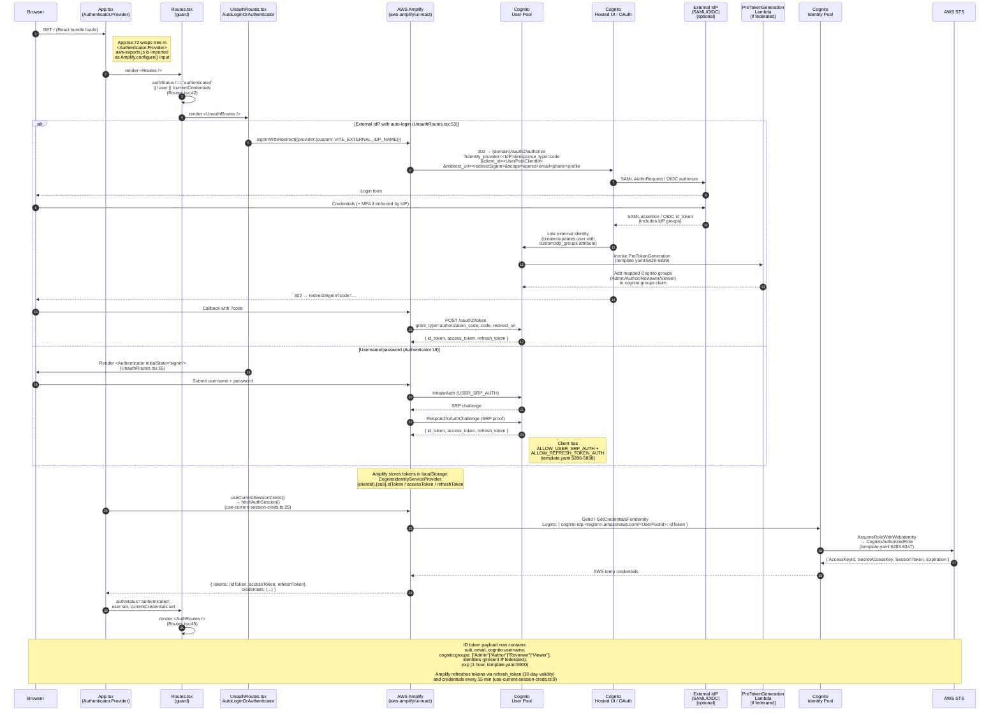
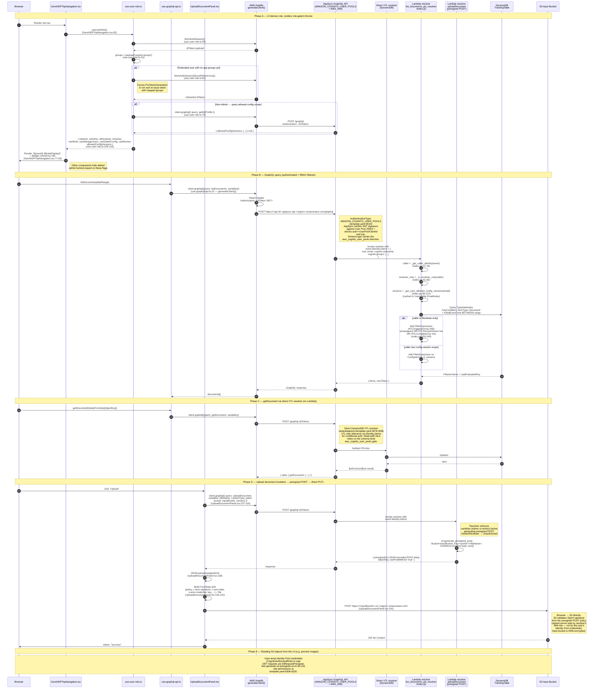
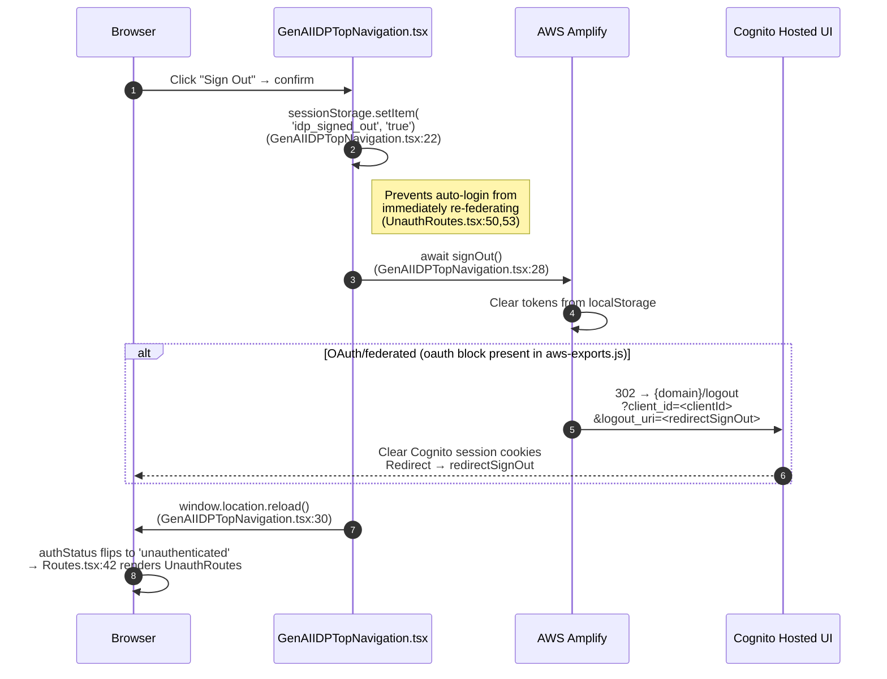

# UI Authentication & Authorization — End-to-End Sequence

This document traces the data flow from a user visiting the GenAIIDP UI login page through to an **authenticated and authorized** backend call (GraphQL query/mutation, S3 upload, etc.).

There are two distinct concerns:

1. **Authentication (AuthN)** — *Who are you?* Proves identity via Cognito User Pool (username/password SRP) or an external SAML/OIDC IdP federated through Cognito. Result: a Cognito-issued **ID token** (JWT) containing the user's email, `sub`, and `cognito:groups` claim.
2. **Authorization (AuthZ)** — *What can you do?* Two layers:
   - **Transport-level**: AppSync validates the ID token on every request (via the `AMAZON_COGNITO_USER_POOLS` auth type) and GraphQL types are gated by `@aws_cognito_user_pools`.
   - **Role-level (RBAC)**: Cognito groups (`Admin`, `Author`, `Reviewer`, `Viewer`) are inspected — client-side for UI rendering and server-side inside Lambda resolvers (via `event.identity.claims['cognito:groups']`) — to filter data and gate mutations.
3. **AWS resource access** — After sign-in, Amplify exchanges the ID token for **temporary AWS credentials** from the Cognito Identity Pool (`CognitoAuthorizedRole`). These are used for direct-to-S3 reads and for IAM-signed paths on AppSync.

---

## 1. Authentication — from login page to ID token



### Key AuthN files

| Concern | File | Ref |
|---|---|---|
| Amplify setup | `src/ui/src/aws-exports.js` | [aws-exports.js:32-51](../src/ui/src/aws-exports.js#L32-L51) — `authenticationType: 'AMAZON_COGNITO_USER_POOLS'`, identity pool id, OAuth block (only if `VITE_EXTERNAL_IDP_NAME` set) |
| Root auth provider | `src/ui/src/App.tsx` | [App.tsx:72](../src/ui/src/App.tsx#L72) — `<Authenticator.Provider>` wraps app |
| Guard | `src/ui/src/routes/Routes.tsx` | [Routes.tsx:42](../src/ui/src/routes/Routes.tsx#L42) — requires `authStatus==='authenticated' && user && currentCredentials` |
| Login UI + federation redirect | `src/ui/src/routes/UnauthRoutes.tsx` | [UnauthRoutes.tsx:47-89](../src/ui/src/routes/UnauthRoutes.tsx#L47-L89) — auto-login branch; Amplify `<Authenticator>` fallback |
| Session + temp creds | `src/ui/src/hooks/use-current-session-creds.ts` | [use-current-session-creds.ts:23-33](../src/ui/src/hooks/use-current-session-creds.ts#L23-L33) — `fetchAuthSession()`, 15-min refresh |
| Cognito User Pool | `template.yaml` | [template.yaml:5783-5860](../template.yaml#L5783-L5860) — password policy, email verify, triggers |
| Cognito User Pool Client | `template.yaml` | [template.yaml:5861-5916](../template.yaml#L5861-L5916) — SRP + refresh flows, 1h token, 30d refresh, no secret |
| Cognito Groups | `template.yaml` | [template.yaml:6373-6409](../template.yaml#L6373-L6409) — Admin/Author/Reviewer/Viewer + admin attachment |
| Identity Pool + Auth Role | `template.yaml` | [template.yaml:6268-6347](../template.yaml#L6268-L6347) — `AllowUnauthenticatedIdentities: false`; S3/KMS/AppSync grants |
| External IdP group mapping | `template.yaml` | [template.yaml:6047-6180](../template.yaml#L6047-L6180) — PreTokenGeneration Lambda config |

---

## 2. Authorization — using the ID token on every backend call

Once authenticated, every backend call reuses the same ID token (plus temp AWS creds for direct S3). This diagram shows three representative call paths: a GraphQL query, a mutation that results in a direct-to-S3 upload, and a DynamoDB-backed resolver that applies RBAC filtering.



### Two ways AppSync validates a request

| Auth mode | Token the browser sends | Where it's used | Reference |
|---|---|---|---|
| `AMAZON_COGNITO_USER_POOLS` (primary) | `Authorization: <Cognito ID token JWT>` | Every UI → AppSync call. AppSync verifies JWT signature against the User Pool JWKS, checks `aud` and `exp`, and populates `$ctx.identity.claims` / `event.identity.claims` (with `cognito:groups`, `sub`, `email`) for the resolver. | [template.yaml:6515](../template.yaml#L6515) |
| `AWS_IAM` (additional) | SigV4 signature using temp creds | Server-to-server paths and any UI path that needs IAM-level auth (some subscriptions / Lambda callers). Grants on the UI side come from `CognitoAuthorizedRole`'s `appsync:GraphQL` statement. | [template.yaml:6520-6521](../template.yaml#L6520-L6521), role at [template.yaml:6338-6347](../template.yaml#L6338-L6347) |

Types the UI reads/writes carry one or both of these directives in `nested/appsync/src/api/schema.graphql` (e.g. `type Document ... @aws_cognito_user_pools @aws_iam`). If a type is missing the directive a caller uses, AppSync rejects the request before any resolver runs.

---

## 3. RBAC — how Cognito groups gate behavior

Groups are defined **once** in Cognito (`Admin`, `Author`, `Reviewer`, `Viewer` — [template.yaml:6373-6409](../template.yaml#L6373-L6409)) and enforced **twice**:

### Client-side (UI chrome, convenience — not security)

`useUserRole()` reads `cognito:groups` from the ID token and exposes derived flags:

| Flag | Definition | Used for |
|---|---|---|
| `isAdmin` / `isAuthor` / `isReviewer` / `isViewer` | `groups.includes(...)` | Role badge in top nav |
| `canWrite` | `isAdmin \|\| isAuthor` | Enable Upload, Edit, Reprocess, Abort |
| `canManageUsers` | `isAdmin` | Show Users admin page |
| `canDeleteConfig` | `isAdmin` | Show destructive config actions |
| `canReview` | `isAdmin \|\| isReviewer` | Show HITL review queue |
| `allowedConfigVersions` | From `getMyProfile` (null = unrestricted) | Filter config pickers for non-Admins |

[use-user-role.ts:96-123](../src/ui/src/hooks/use-user-role.ts#L96-L123)

### Server-side (authoritative)

Every Lambda resolver re-derives the caller from `event.identity.claims` and does **not** trust anything the UI sends:

```python
def _get_caller_identity(event):
    claims = event.get("identity", {}).get("claims", {})
    groups = claims.get("cognito:groups", [])
    ...
    return { "groups": groups, "is_admin": "Admin" in groups,
             "is_author": "Author" in groups, "is_reviewer": "Reviewer" in groups,
             "is_viewer": "Viewer" in groups, ... }
```

Example — the list-documents resolver at [nested/appsync/src/lambda/list_documents_gsi_resolver/index.py:57-241](../nested/appsync/src/lambda/list_documents_gsi_resolver/index.py#L57-L241):

1. `_get_caller_identity(event)` at [:57](../nested/appsync/src/lambda/list_documents_gsi_resolver/index.py#L57).
2. `_is_reviewer_only(caller)` at [:81](../nested/appsync/src/lambda/list_documents_gsi_resolver/index.py#L81) — reviewer-only users see only HITL-pending documents that are unassigned, assigned to them, or already completed by them.
3. `_get_user_allowed_config_versions(email)` at [:86-122](../nested/appsync/src/lambda/list_documents_gsi_resolver/index.py#L86-L122) — scope non-Admins to specific configuration versions (cached via `UsersTable.EmailIndex`).
4. DynamoDB `Query TypeDateIndex` with `FilterExpression` composed from those flags — the user never sees items the filter excludes.

Mutations (delete, reprocess, uploadDocument, user management) apply the same pattern but reject outright when `canWrite`/`canManageUsers` is false.

---

## 4. Sign-out



---

## 5. Summary of tokens and credentials in play

| Credential | Issuer | Stored where | Lifetime | Used for |
|---|---|---|---|---|
| **ID token** (JWT) | Cognito User Pool | Amplify localStorage (`CognitoIdentityServiceProvider.<clientId>.<sub>.idToken`) | 1 h ([template.yaml:5900](../template.yaml#L5900)) | `Authorization` header on every AppSync call; source of `cognito:groups`, `email`, `sub` |
| **Access token** (JWT) | Cognito User Pool | localStorage | 1 h ([template.yaml:5894](../template.yaml#L5894)) | OAuth-scoped APIs (not used by the IDP resolvers) |
| **Refresh token** | Cognito User Pool | localStorage | 30 d ([template.yaml:5910](../template.yaml#L5910)) | Silent re-issue of id/access tokens |
| **Temp AWS credentials** | Cognito Identity Pool → STS AssumeRoleWithWebIdentity → `CognitoAuthorizedRole` | In-memory (`useCurrentSessionCreds`) | ~1 h (STS default); refreshed every 15 min ([use-current-session-creds.ts:9](../src/ui/src/hooks/use-current-session-creds.ts#L9)) | Browser-side SigV4 for direct S3 GETs, KMS decrypt, SSM param read, IAM-auth AppSync calls ([template.yaml:6306-6347](../template.yaml#L6306-L6347)) |
| **Presigned POST (per-upload)** | Server-side Lambda resolver signing with its own IAM role | In the `uploadDocument` response, used once | Short (Conditions expiry) | Browser → S3 direct upload of input documents ([UploadDocumentPanel.tsx:107-158](../src/ui/src/components/upload-document/UploadDocumentPanel.tsx#L107-L158)) |

---

## 6. Key source references

### Frontend — authentication & session
- [App.tsx:72](../src/ui/src/App.tsx#L72) — `<Authenticator.Provider>` boundary
- [Routes.tsx:42](../src/ui/src/routes/Routes.tsx#L42) — auth gate
- [UnauthRoutes.tsx:47-89](../src/ui/src/routes/UnauthRoutes.tsx#L47-L89) — auto-login + Authenticator fallback
- [aws-exports.js:8-51](../src/ui/src/aws-exports.js#L8-L51) — Amplify configuration from CodeBuild env vars
- [use-current-session-creds.ts:23-62](../src/ui/src/hooks/use-current-session-creds.ts#L23-L62) — `fetchAuthSession` + 15-min refresh
- [use-user-role.ts:46-94](../src/ui/src/hooks/use-user-role.ts#L46-L94) — group extraction + federated forceRefresh

### Frontend — backend calls
- [use-graphql-api.ts:22](../src/ui/src/hooks/use-graphql-api.ts#L22) — `generateClient()` (Amplify attaches ID token)
- [UploadDocumentPanel.tsx:107-158](../src/ui/src/components/upload-document/UploadDocumentPanel.tsx#L107-L158) — mutation → presigned POST → direct S3 upload
- [generate-s3-presigned-url.ts:46-133](../src/ui/src/components/common/generate-s3-presigned-url.ts#L46-L133) — SigV4 presign using Identity Pool creds (read path)
- [GenAIIDPTopNavigation.tsx:19-34](../src/ui/src/components/genai-idp-top-navigation/GenAIIDPTopNavigation.tsx#L19-L34) — sign-out

### Backend — AuthN/AuthZ infrastructure
- [template.yaml:5783-5860](../template.yaml#L5783-L5860) — Cognito User Pool
- [template.yaml:5861-5916](../template.yaml#L5861-L5916) — User Pool Client (auth flows, token lifetimes)
- [template.yaml:6262-6265](../template.yaml#L6262-L6265) — Cognito Domain (Hosted UI)
- [template.yaml:6268-6347](../template.yaml#L6268-L6347) — Identity Pool + `CognitoAuthorizedRole` grants
- [template.yaml:6373-6409](../template.yaml#L6373-L6409) — RBAC groups
- [template.yaml:6047-6180](../template.yaml#L6047-L6180) — External-IdP group mapping (PreTokenGeneration)
- [template.yaml:6510-6528](../template.yaml#L6510-L6528) — AppSync GraphQLApi (`AMAZON_COGNITO_USER_POOLS` + `AWS_IAM`)

### Backend — authorization in resolvers
- [nested/appsync/src/api/schema.graphql](../nested/appsync/src/api/schema.graphql) — `@aws_cognito_user_pools` / `@aws_iam` directives on types
- [list_documents_gsi_resolver/index.py:57-241](../nested/appsync/src/lambda/list_documents_gsi_resolver/index.py#L57-L241) — canonical RBAC pattern: extract claims → derive flags → apply DDB filter
